### 一.简介
Terraform 多云管理

支持的云厂商： 腾讯云(tencentcloud), 阿里云(alicloud)等
<p></p>
整体架构如下图：

----



---

依赖内容：
1. python 2.7

2. terraform (cli, 建议将terraform的provide 插件cache进行加速，具体可参考文档中(`terraform 插件配置`))
3. 公有云厂商(例如腾讯云，阿里云)， 用户自行进行开通， 并参考各云厂商申请API key，

   若为子账号则需要足够的资源申请权限(包括但不限于：
   1）. 使用的云资源的权限(创建，删除， 修改权限)，
   2）. 账户对资源的付费权限(没有该权限可能创建失败)，
   3）. 服务端ip对公有云厂商的访问权限)

### 二. 安装
运行环境依赖python环境，可按如下步骤进行初始化

1. 安装rpm包：
```
yum install gcc -y
yum install -y python-virtualenv.noarch
```

2. 创建python独立环境：
```
mkdir -p /wecube
cd /wecube
virtualenv terraform_env
 . /wecube/terraform_env/bin/activate
```

3. 初始化依赖包：
```
mkdir /apps/wecube_plugins_terraform
cd /apps/wecube_plugins_terraform
git clone https://github.com/WeBankPartners/wecube-plugins-terraform.git
pip install -r requirements.txt
```

4. 安装terraform：
(用户可在terraform官网进行[下载](https://www.terraform.io/downloads.html)安装， 参考`terraform 插件配置`配置加速)

5. 更新conf：
更新conf目录下application.conf 配置文件，更新数据库连接配置及其他配置

6. 运行：
```
sh  bin/start.sh
```

### 三. terraform 插件配置
在plugins 中创建provider name 目录， 如terraform插件有版本要求则写入对应的版本需求文件 versions.tf

例如： 腾讯云 tencentcloud,
则在 plugins 下创建 tencentcloud 目录， 并创建version.tf 文件

注： 为加速terraform执行， 需要将对应的provider插件放在os cache目录中：
`/usr/local/share/terraform/plugins/registry.terraform.io`

例如cache tencentcloud 的插件，
则将tencentcloud插件放入 `/usr/local/share/terraform/plugins/registry.terraform.io/tencentcloudstack`

### 四. terraform docker镜像打包：

1. 镜像打包需要python:2.7.18-slim为基础镜像

2. 镜像需要依赖terraform cli 以及cache的加速， 需要将对应的依赖包放入对应目录

1. 将terraform cli 软件包放入源码文件的bin目录下

 例如当前源码文件为/data/wecube_plugins_terraform， cli版本文件(例如：terraform_0.14.5_linux_amd64.zip），
 则放入/data/wecube_plugins_terraform/bin  并修改Makefile的`cd bin && unzip -o terraform_0.14.5_linux_amd64.zip`

2. cache 加速：

将对应插件的完整目录打包成registry.terraform.io.tar.gz 放入到源码文件的plugins目录下，
并修改Dockerfile的tar -xvf /app/wecube_plugins_terraform/plugins/registry.terraform.io.tar.gz

### 五. terraform 接入云厂商配置信息
转换规则：

字段属性转换定义说明：
1. string 直接转换为对应的值， 若为空字符串，则不转换， 如 {"cider": ''}

2. json 定义约束, 类型为json
   1. type定义类型, 可定义： [string, int, float, json, list]
   2. allow_null 是否允许为空， 0 为不允许为空，反之则允许为空
   3. convert 转换为对应的字段名称， 若不定义，则不转换

   例如： "name": {"type": "string", "allow_null": 0, "convert": "name"}
    name字段，定义type为string， 不运行为空， 转换为name

3. 要求的关键字不使用， 则可使用减号移除， 如：{"tag": "-"}

#### 如下以腾讯云为例， 其他云厂商接入类似, 可参考进行配置：

1. 配置云厂商：
url: /terraform/v1/configer/provider

```
{
    "display_name":"腾讯云",
    "name":"tencentcloud",
    "zone":"",
    "region":"",
    "secret_id":"xxxx", # 云厂商提供的api key信息
    "secret_key":"xxxx", # 云厂商提供的api key信息
    "extend_info":{

    },
    "provider_property":{
        "secret_id":"secret_id",
        "secret_key":"secret_key",
        "region":"region"
    }
}
```
secret_id 云厂商提供的api key信息

secret_key 云厂商提供的api key信息

provider_property配置字段的转换： 如secret_id 需要转换为api_id 则配置 "secret_id": "api_id"

2. 配置属性资源：

例如： vpc 网段配置：

url: /terraform/v1/configer/resource

1).资源
```
{
"resource_type": "vpc",
"resource_name": "tencentcloud_vpc",
"provider": "tencentcloud",
"extend_info": {"tags": {"type": "json"}, "is_multicast": false},
"resource_property": {
	"name": {"type": "string", "allow_null": 0, "convert": "name"},
	"cidr": {"type": "string", "allow_null": 0, "convert": "cidr_block"}
},
"resource_output": {"resource_id": {"type": "string", "value": "id"}},
"data_source_name": "tencentcloud_vpc_instances",
"data_source_argument": "instance_list",
"data_source": {"resource_id": "vpc_id"},
"data_source_output": {"resource_id": "vpc_id"}
}
```

2).回刷云上已有资源信息
```
{
"data_source_name": "tencentcloud_vpc_subnets",
"data_source_argument": "instance_list",
"data_source": {"resource_id": "subnet_id"},
"data_source_output": {"resource_id": "vpc_id"}
}
```
<p>
source_property回刷data名称
data_source_argument 获取回刷数据的字段名称, 可使用层级, 如: instance.configs
data_source 设置查询的字段转换信息
data_source_output 需要转换统一输出的字段
</p>

3. 配置通用值

用于将云厂商之间不同的值进行统一

例如image字段的 centos 7.2字段,
云厂商A为： centos-7.2 x64,
原厂商B为： linux centos 7.2 x64,
则可以统一命名为centos 7.2 进行转换

url: /terraform/v1/configer/keyconfig

```
{
"resource": "subnet",
"resource_type": "cidr",
"provider": "tencentcloud",
"value_config": {
	"subnet_20": "10.0.20.0/24",
	"subnet_1": "10.0.1.0/24"
    }
}
```

