# 华为云多云配置

*从Excel文件自动转换: 华为云多云配置.xlsx*

*转换时间: 2025-10-17 12:58:17*

## 目录

- [资源组1](#资源组1)
- [资源组2](#资源组2)
- [资源组3](#资源组3)
- [调试代码](#调试代码)
- [terraform插件配置相关](#terraform插件配置相关)
- [后端需添加字段](#后端需添加字段)
- [编排问题记录](#编排问题记录)

---

## 资源组1

| **插件定义** | **含义** | **aws定义** | **huaweicloud定义** | **接口** | **wecube入参** | **aws入参** | **aws入参含义** | **huaweicloud入参** | **huaweicloud入参说明** |  |  |  |  |
| --- | --- | --- | --- | --- | --- | --- | --- | --- | --- | --- | --- | --- | --- |
| clb | 负载均衡器（Cloud Load Balancer, CLB） 实例。负载均衡器是一种将流量分发到多个后端服务器的网络设备，可提高应用的可用性和扩展性。 | aws_lb https://registry.terraform.io/providers/hashicorp/aws/latest/docs/resources/lb | huaweicloud_lb_loadbalancer https://registry.terraform.io/providers/huaweicloud/huaweicloud/latest/docs/resources/lb_loadbalancer | apply | app_security_group_ids | security_groups | 要分配给 LB 的安全组 ID 列表。仅对应用程序或网络类型的负载均衡器有效。对于类型为网络安全组的负载均衡器，如果当前不存在，则无法添加，并且一旦添加就无法全部删除。 | 无对应 |  |  |  |  |  |
|  |  |  |  |  | base_security_group_ids | subnets | 要附加到 LB 的子网 ID 列表。对于只能添加网络子网类型的负载均衡器 | 无对应 |  |  |  |  |  |
|  |  |  |  |  | subnet_id |  |  | vip_subnet_id* | 负载均衡器工作的子网的 IPv4 子网 ID。更改此设置将创建一个新的负载均衡器 |  |  |  |  |
|  |  |  |  |  | tags | tags |  | tags |  |  |  |  |  |
|  |  |  |  |  | name | name | 负载均衡器的名称不必是唯一的 | name | LB 的名称。此名称在您的 AWS 账户中必须是唯一的，最多可以包含 32 个字符，只能包含字母数字字符或连字符，并且不得以连字符开头或结尾。如果未指定，Terraform 将自动生成以 tf-lb 开头的名称 |  |  |  |  |
|  |  |  |  |  | ip_address |  |  | vip_address |  |  |  |  |  |
|  |  |  |  |  | id | id |  |  |  |  |  |  |  |
|  |  |  |  |  | asset_id | id |  |  |  |  |  |  |  |
| clb_listener | 用于配置 负载均衡器监听器 | aws_lb_listener https://registry.terraform.io/providers/hashicorp/aws/5.75.1/docs/resources/lb_listener | huaweicloud_lb_listener https://registry.terraform.io/providers/huaweicloud/huaweicloud/latest/docs/resources/lb_listener | apply | 无对应 | default_action* |  | 无对应 |  |  |  |  |  |
|  |  |  |  |  | protocol | protocol | 对于 Application Load Balancer，有效值为 HTTP 和 HTTPS，默认值为 HTTP。 对于网络负载均衡器，有效值为 TCP、TLS、UDP 和 TCP_UDP。如果启用了双堆栈模式，则不适用于使用 UDP 或 TCP_UDP。对网关负载均衡器无效 | protocol* | 协议可以是 TCP、UDP、HTTP 或 TERMINATED_HTTPS |  |  |  |  |
|  |  |  |  |  | port | port | 负载均衡器正在侦听的端口。对网关负载均衡器无效 | protocol_port* | 侦听客户端流量的端口 |  |  |  |  |
|  |  |  |  |  | clb_id | load_balancer_arn* | 负载均衡器的 ARN | loadbalancer_id* | 要在其上预配此侦听器的负载均衡器 |  |  |  |  |
|  |  |  |  |  | target_group_id | target_group_arn | 侦听器关联的默认池的ARN | default_pool_id | 侦听器关联的默认池的ID | 监听器不需要设置后端组，在转发规则里面配置就好了 |  |  |  |
|  |  |  |  |  | asset_id | id |  |  |  |  |  |  |  |
|  |  |  |  |  | id | id |  |  |  |  |  |  |  |
| clb_rule_forward | 提供负载均衡器侦听器规则资源 | aws_lb_listener_rule https://registry.terraform.io/providers/hashicorp/aws/5.75.1/docs/resources/lb_listener_rule#action-1 | huaweicloud_lb_l7policy https://registry.terraform.io/providers/huaweicloud/huaweicloud/latest/docs/resources/lb_l7policy | apply | 无对应 | condition* | 可以设置多个不同类型的条件块，并且必须满足所有条件块才能使规则匹配 |  |  |  |  |  |  |
|  |  |  |  |  | rule_path | condition.path_pattern | 该项是要与请求 URL 匹配的路径模式列表 |  |  |  |  |  |  |
|  |  |  |  |  | 无对应 | action* |  | action* | 指定是将请求转发到另一个后端服务器组还是重定向到 HTTPS 侦听器REDIRECT_TO_POOL、REDIRECT_TO_LISTENER |  |  |  |  |
|  |  |  |  |  | 无对应 | action.type | 有效值为 forward、redirect、fixed-response、authenticate-cognito 和 authenticate-oidc |  |  |  |  |  |  |
|  |  |  |  |  | target_group_id | action.target_group_arn | 要将流量路由到的目标组的 ARN。仅当类型为正向且要路由到单个目标组时才指定。要路由到一个或多个目标组，请改用转发块。不能用正向指定 | 根据action的值传入redirect_pool_id或者redirect_listener_id* |  |  |  |  |  |
|  |  |  |  |  | clb_listener_id | listener_arn* | 要附加规则的侦听器的 ARN | listener_id* | 指定为其添加转发策略的侦听器的 ID。更改此设置将创建新的 L7 策略 |  |  |  |  |
|  |  |  |  |  | asset_id | id |  |  |  |  |  |  |  |
|  |  |  |  |  | id | id |  |  |  |  |  |  |  |
|  |  |  | huaweicloud_lb_l7rule https://registry.terraform.io/providers/huaweicloud/huaweicloud/latest/docs/resources/lb_l7rule |  | 无对应 | condition* | 可以设置多个不同类型的条件块，并且必须满足所有条件块才能使规则匹配 |  |  |  |  |  |  |
|  |  |  |  |  | rule_path | condition.path_pattern | 该项是要与请求 URL 匹配的路径模式列表 |  |  |  |  |  |  |
|  |  |  |  |  |  |  |  | type* | L7 规则类型 - 可以是 HOST_NAME 或 PATH | 给默认值PATH |  |  |  |
|  |  |  |  |  |  |  |  | compare_type* | L7 规则的比较类型 - 可以是 STARTS_WITH、EQUAL_TO 或 REGEX | 给默认值REGEX |  |  |  |
|  |  |  |  |  |  |  |  | l7policy_id* | 要查询的 L7 策略的 ID |  |  |  |  |
|  |  |  |  |  | rule_path |  |  | value* | 用于比较的值 |  |  |  |  |
|  |  |  |  |  | asset_id | id |  |  |  |  |  |  |  |
|  |  |  |  |  | id | id |  |  |  |  |  |  |  |
| clb_target_group | 用于创建 负载均衡器目标组（Target Group）。目标组是一种逻辑分组机制，允许将多个后端服务器（如云服务器 CVM、弹性网卡 ENI）组织在一起，以便负载均衡器将流量分发到这些服务器。目标组可被多个监听器共享，提高配置复用性 | aws_lb_target_group https://registry.terraform.io/providers/hashicorp/aws/5.75.1/docs/resources/lb_target_group | huaweicloud_lb_pool https://registry.terraform.io/providers/huaweicloud/huaweicloud/latest/docs/resources/lb_pool | apply | 无对应（给默认值） | protocol* | 将流量路由到目标的协议。应为 GENEVE、HTTP、HTTPS、TCP、TCP_UDP、TLS 或 UDP 之一。 当 target_type 为 instance、ip 或 alb 时，这是必需的。当 target_type 为 lambda 时不适用 | protocol* | 可以是 TCP、UDP 或 HTTP，与监听器的协议对应 |  |  |  |  |
|  |  |  |  |  | targets | vpc_id | 要在其中创建目标组的 VPC 的标识符。当 target_type 为 instance、ip 或 alb 时，这是必需的 | 无对应 | AWS: vpc_id是Target Group的必需参数 华为云: Pool不需要vpc_id，VPC信息通过LoadBalancer → Listener → Pool的层级关系自动继承 迁移时: 确保LoadBalancer正确配置了vpc_id，Pool会自动使用相同的VPC # 创建负载均衡器（指定VPC） resource "huaweicloud_lb_loadbalancer" "example" { name = "example-lb" type = "External" vpc_id = "vpc-12345678" # VPC在这里指定 } # 创建监听器 resource "huaweicloud_lb_listener" "example" { name = "example-listener" loadbalancer_id = huaweicloud_lb_loadbalancer.example.id protocol = "HTTP" protocol_port = 80 } # 创建后端服务器组（自动继承VPC） resource "huaweicloud_lb_pool" "example" { name = "example-pool" protocol = "HTTP" lb_method = "ROUND_ROBIN" listener_id = huaweicloud_lb_listener.example.id # 不需要指定vpc_id，通过listener_id自动关联 } | # 创建负载均衡器（指定VPC） resource "huaweicloud_lb_loadbalancer" "example" { name = "example-lb" type = "External" vpc_id = "vpc-12345678" # VPC在这里指定 } # 创建监听器 resource "huaweicloud_lb_listener" "example" { name = "example-listener" loadbalancer_id = huaweicloud_lb_loadbalancer.example.id protocol = "HTTP" protocol_port = 80 } # 创建后端服务器组（自动继承VPC） resource "huaweicloud_lb_pool" "example" { name = "example-pool" protocol = "HTTP" lb_method = "ROUND_ROBIN" listener_id = huaweicloud_lb_listener.example.id # 不需要指定vpc_id，通过listener_id自动关联 } |  |  |  |
|  |  |  |  |  | name | name | 目标组的名称。如果省略，最多可以包含 32 个字符，只能包含字母数字字符或连字符，并且不得以连字符开头或结尾 | name |  |  |  |  |  |
|  |  |  |  |  | port | port* | 当 target_type 为 instance、ip 或 alb 时，这是必需的 | 无直接对应（对应huaweicloud_lb_member 中的protocol_port） | AWS: port是Target Group的必需参数，定义后端服务器端口 华为云: 端口在huaweicloud_lb_member的protocol_port参数中指定 迁移时: 将AWS Target Group的port值迁移到华为云每个lb_member的protocol_port参数中 | # 创建后端服务器组 resource "huaweicloud_lb_pool" "example" { name = "example-pool" protocol = "HTTP" lb_method = "ROUND_ROBIN" listener_id = huaweicloud_lb_listener.example.id } # 添加后端服务器（在这里指定端口） resource "huaweicloud_lb_member" "example" { pool_id = huaweicloud_lb_pool.example.id address = "192.168.1.10" protocol_port = 80 # 对应AWS的port参数 weight = 1 } resource "huaweicloud_lb_member" "example2" { pool_id = huaweicloud_lb_pool.example.id address = "192.168.1.11" protocol_port = 8080 # 可以有不同的端口 weight = 1 } |  |  |  |
|  |  |  |  |  | clb_id | 无对应 |  | loadbalancer_id | 挂载的负载均衡器，至少提供 LoadbalancerID 或 ListenerID 中的一个 |  |  |  |  |
|  |  |  |  |  | 无对应 | 无对应 |  | listener_id | 关联的侦听器，至少提供 LoadbalancerID 或 ListenerID 中的一个 |  |  |  |  |
|  |  |  |  |  | 无对应 | load_balancing_algorithm_type | 负载均衡算法，值为 round_robin、least_outstanding_requests 或 weighted_random。默认值为 round_robin | lb_method* | 负载均衡算法。必须是 ROUND_ROBIN、LEAST_CONNECTIONS 或 SOURCE_IP 之一 |  |  |  |  |
|  |  |  |  |  | asset_id | id |  |  |  |  |  |  |  |
|  |  |  |  |  | id | id |  |  |  |  |  |  |  |
|  |  | lb_target_group_attachment https://registry.terraform.io/providers/hashicorp/aws/5.75.1/docs/resources/lb_target_group_attachment | huaweicloud_lb_member https://registry.terraform.io/providers/huaweicloud/huaweicloud/latest/docs/resources/lb_member |  | 无对应 | target_group_arn* | 注册目标的目标组的 ARN | pool_id* | 目标目标成员的pool id |  |  |  |  |
|  |  |  |  |  | instance_id 是否可以接受IP地址 | target_id* | 目标的实例ID，主机资源 | address* | 从负载均衡器接收流量的成员的 IP 地址 | 使用主机资源出参返回的fixed_ip_v4 |  |  |  |
|  |  |  |  |  | 无对应 | ROOT |  |  |  |  |  |  |  |
|  |  |  |  |  | 无对应 |  |  | subnet_id* | 要访问成员的子网的 IPv4 子网 ID | 添加字段subnet_id |  |  |  |
|  |  |  |  |  | port |  |  | protocol_port* | 侦听客户端流量的端口 |  |  |  |  |
|  |  |  |  |  |  |  |  |  |  |  |  |  |  |
|  |  |  |  |  |  |  |  |  |  |  |  |  |  |
| cos_bucket | 提供华为云提供 OBS 桶资源 | aws_s3_bucket https://registry.terraform.io/providers/hashicorp/aws/5.75.1/docs/resources/s3_bucket | huaweicloud_obs_bucket https://registry.terraform.io/providers/huaweicloud/huaweicloud/latest/docs/resources/obs_bucket | apply | acl | acl | 应用的固定 ACL。有效值为 private、public-read、public-read-write、aws-exec-read、authenticated-read 和 log-delivery-write | acl | 指定存储桶的 ACL 策略。预定义的通用策略如下：“private”、“public-read”、“public-read-write”和“log-delivery-write”。默认为 private |  |  |  |  |
|  |  |  |  |  | tags | tags | 标签 | tags | 标签 |  |  |  |  |
|  |  |  |  |  | name | bucket | 存储桶的名称 | bucket* | 名称必须包含 3 到 63 个字符。仅允许使用小写字母、数字、连字符 （-） 和句点 （.） |  |  |  |  |
|  |  |  |  |  | asset_id | id |  |  |  |  |  |  |  |
|  |  |  |  |  | id | id |  |  |  |  |  |  |  |
| cos_user | 管理华为云中的 IAM 用户资源 | aws_iam_user https://registry.terraform.io/providers/hashicorp/aws/5.75.1/docs/resources/iam_user | huaweicloud_identity_user https://registry.terraform.io/providers/huaweicloud/huaweicloud/latest/docs/resources/identity_user | apply | name | name* | 用户名称 | name* | 用户名由 1 到 32 个字符组成。它只能包含大写字母、小写字母、数字、空格和特殊字符 （-_），并且不能以数字开头 |  |  |  |  |
|  |  |  |  |  | asset_id | id |  |  |  |  |  |  |  |
|  |  |  |  |  | id | id |  |  |  |  |  |  |  |
| ccn_attach | 云连接（Cloud Connect, CC）服务 |  | huaweicloud_cc_network_instance https://registry.terraform.io/providers/huaweicloud/huaweicloud/latest/docs/resources/cc_network_instance | apply | instance_type |  |  | type* | 云连接的网络实例的类型，vpc或者vgw | 给默认值vpc |  |  |  |
|  |  |  |  |  | instance_id |  |  | instance_id* | vpc的id |  |  |  |  |
|  |  |  |  |  |  |  |  | cidrs* | VPC 或虚拟网关通告的路由列表 |  |  |  |  |
|  |  |  |  |  |  |  |  | project_id* |  |  |  |  |  |
|  |  |  |  |  | instance_region_id |  |  | region_id* |  |  |  |  |  |
|  |  |  |  |  | ccn_id |  |  | cloud_connection_id* |  |  |  |  |  |
|  |  |  |  |  | asset_id | id |  |  |  |  |  |  |  |
|  |  |  |  |  | id | id |  |  |  |  |  |  |  |
| ccn | 云连接（Cloud Connect, CC）服务 |  | huaweicloud_cc_connection https://registry.terraform.io/providers/huaweicloud/huaweicloud/latest/docs/resources/cc_connection | apply | name |  |  | name* | 1 到 64 个字符，只允许使用英文字母、汉字、数字、连字符 （-）、下划线 （_） 和点 （.） |  |  |  |  |
|  |  |  |  |  | tags |  |  | tags | 标签属性 |  |  |  |  |
|  |  |  |  |  | asset_id | id |  |  |  |  |  |  |  |
|  |  |  |  |  | id | id |  |  |  |  |  |  |  |

## 资源组2

### 相关图片

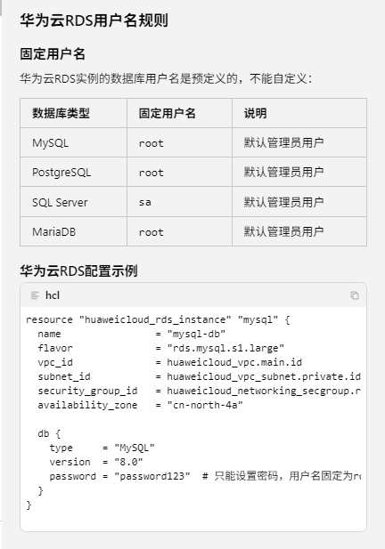

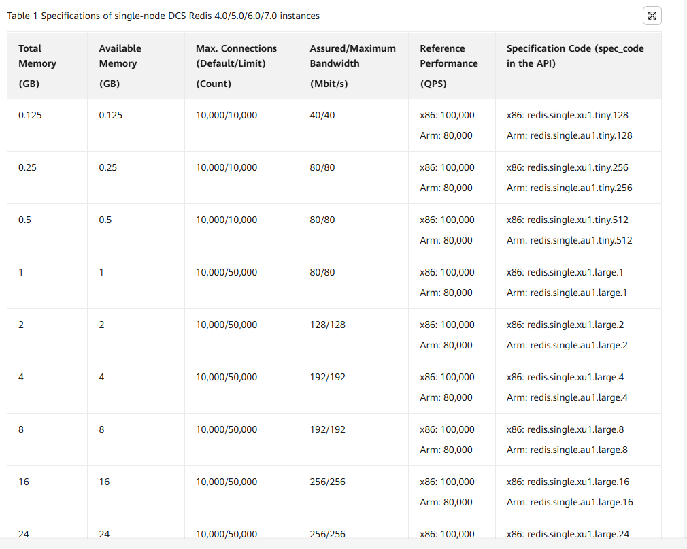

---

| **插件定义** | **AWS定义** | **华为云定义** | **接口** | **wecube入参** | **AWS入参** | **入参含义** | **华为云入参** | **入参含义** | **备注** |  |  |  |  |  |  |  |  |  |  |  |  |  |
| --- | --- | --- | --- | --- | --- | --- | --- | --- | --- | --- | --- | --- | --- | --- | --- | --- | --- | --- | --- | --- | --- | --- |
| cvm 管理云服务器上的虚拟机实例 | aws_instance https://registry.terraform.io/providers/hashicorp/aws/5.75.1/docs/resources/instance | huaweicloud_compute_instance https://registry.terraform.io/providers/huaweicloud/huaweicloud/latest/docs/resources/compute_instance | apply | app_security_group_ids | vpc_security_group_ids | 要关联的安全组 ID 列表 | security_group_ids | 指定要与实例关联的一个或多个安全组 ID 的数组 |  |  |  |  |  |  |  |  |  |  |  |  |  |  |
|  |  |  |  | tags | tags | 指定要与实例关联的键/值对 | tags |  |  |  |  |  |  |  |  |  |  |  |  |  |  |  |
|  |  |  |  | ssh_key | key_name | 要用于实例的密钥对的密钥名称;可以使用 aws_key_pair 资源进行管理 | key_pair | 指定用于登录实例的 SSH 密钥对名称 |  |  |  |  |  |  |  |  |  |  |  |  |  |  |
|  |  |  |  |  | root_block_device | 配置块，用于自定义有关实例的根块设备的详细信息 |  |  |  |  |  |  |  |  |  |  |  |  |  |  |  |  |
|  |  |  |  | system_disk_type | root_block_device.volume_type | 有效值包括 standard、gp2、gp3、io1、io2、sc1 或 st1 | system_disk_type | SAS: High I/O disk type. SAS：高 I/O 磁盘类型。 SSD: Ultra-high I/O disk type. SSD：超高 I/O 磁盘类型。 GPSSD: General purpose SSD disk type. GPSSD：通用 SSD 磁盘类型。 ESSD: Extreme SSD type. ESSD：极限 SSD 类型。 GPSSD2: General purpose SSD V2 type. GPSSD2：通用 SSD V2 型。 ESSD2: Extreme SSD V2 type. ESSD2：Extreme SSD V2 类型。 |  |  |  |  |  |  |  |  |  |  |  |  |  |  |
|  |  |  |  | system_disk_size | root_block_device.volume_size | 内存，以千兆字节 （GiB） 为单位 | system_disk_size | 指定系统磁盘大小（以 GB 为单位），值范围为 1 到 1024。不支持收缩磁盘 |  |  |  |  |  |  |  |  |  |  |  |  |  |  |
|  |  |  |  | subnet_id | subnet_id | VPC 子网 ID | network.uuid | 指定要附加到实例的网络 UUID | resource "huaweicloud_compute_instance" "example" { name = "example-instance" image_id = "Ubuntu 20.04 server 64bit" flavor = "s6.small.1" # 主网络接口 network { uuid = huaweicloud_vpc_subnet.public.id } # 辅助网络接口 network { uuid = huaweicloud_vpc_subnet.private.id } } |  |  |  |  |  |  |  |  |  |  |  |  |  |
|  |  |  |  | ip_address | private_ip | 与 VPC 中的实例关联的私有 IP 地址 | network.fixed_ip_v4 |  |  |  |  |  |  |  |  |  |  |  |  |  |  |  |
|  |  |  |  | basic_security_group_ids | vpc_security_group_ids | 要关联的安全组 ID 列表 | security_group_ids | 指定要与实例关联的一个或多个安全组 ID 的数组 |  |  |  |  |  |  |  |  |  |  |  |  |  |  |
|  |  |  |  | zone_id | availability_zone | 启动实例的可用区范围 | availability_zone | 创建实例的可用性区域 |  |  |  |  |  |  |  |  |  |  |  |  |  |  |
|  |  |  |  | instance_type | instance_type | 要用于实例的实例类型 | flavor_id* | 要用于实例的实例规格id s6.small.1 - 1 vCPU, 1 GB RAM s6.small.2 - 1 vCPU, 2 GB RAM s6.medium.2 - 2 vCPU, 4 GB RAM s6.large.2 - 2 vCPU, 8 GB RAM s6.xlarge.2 - 4 vCPU, 8 GB RAM c6.large.2 - 2 vCPU, 4 GB RAM (计算优化) m6.large.2 - 2 vCPU, 16 GB RAM (内存优化) |  |  |  |  |  |  |  |  |  |  |  |  |  |  |
|  |  |  |  | instance_image | ami | 用于实例的 AMI。除非指定了 launch_template 并且启动模板指定了 AMI，否则为必填项。如果在启动模板中指定了 AMI，则设置 ami 将覆盖启动模板中指定的 AMI | image_id和image_name二选一* |  |  |  |  |  |  |  |  |  |  |  |  |  |  |  |
|  |  |  |  | name | name | 名称 | name* | 指定实例的唯一名称。该名称由 1 到 64 个字符组成，包括字母、数字、下划线 （_）、连字符 （-） 和句点 （.） |  |  |  |  |  |  |  |  |  |  |  |  |  |  |
|  |  |  |  | id | id |  |  |  |  |  |  |  |  |  |  |  |  |  |  |  |  |  |
|  |  |  |  | asset_id | id |  |  |  |  |  |  |  |  |  |  |  |  |  |  |  |  |  |
| disk 用于将云硬盘挂载到 CVM 实例 | aws_volume_attachment https://registry.terraform.io/providers/hashicorp/aws/5.75.1/docs/resources/volume_attachment | huaweicloud_compute_volume_attach https://registry.terraform.io/providers/huaweicloud/huaweicloud/latest/docs/resources/compute_volume_attach | apply | attach_instance_id | ROOT |  | ROOT |  |  |  |  |  |  |  |  |  |  |  |  |  |  |  |
|  |  |  |  | 无对应 | volume_id* | ebs实例id | volume_id* | evs实例id |  |  |  |  |  |  |  |  |  |  |  |  |  |  |
|  |  |  |  | attach_instance_id | instance_id* | CVM实例的ID | instance_id* | CVM实例的ID |  |  |  |  |  |  |  |  |  |  |  |  |  |  |
|  |  |  |  |  |  |  |  |  |  |  |  |  |  |  |  |  |  |  |  |  |  |  |
|  | aws_ebs_volume https://registry.terraform.io/providers/hashicorp/aws/5.75.1/docs/resources/ebs_volume | huaweicloud_evs_volume https://registry.terraform.io/providers/hashicorp/aws/5.75.1/docs/resources/ebs_volume | apply | type | type | standard, gp2, gp3, io1, io2, sc1 or st1 (Default: gp2) | volume_type* | SAS、SSD、GPSSD、ESSD、GPSSD2、ESSD2 |  |  |  |  |  |  |  |  |  |  |  |  |  |  |
|  |  |  |  | size | size | 内存大小GiB | size* | 对于系统磁盘，有效值范围为 1 GB 到 1,024 GB。对于数据磁盘，有效值范围为 10 GB 到 32,768 GB |  |  |  |  |  |  |  |  |  |  |  |  |  |  |
|  |  |  |  | zone_id | availability_zone* | ebs实例所在的可用区 | availability_zone* | evs实例所在的可用区 |  |  |  |  |  |  |  |  |  |  |  |  |  |  |
|  |  |  |  | tags | tags | 可用标签 | tags | 与磁盘关联的键/值对 |  |  |  |  |  |  |  |  |  |  |  |  |  |  |
|  |  |  |  | asset_id | id |  |  |  |  |  |  |  |  |  |  |  |  |  |  |  |  |  |
|  |  |  |  | id | id |  |  |  |  |  |  |  |  |  |  |  |  |  |  |  |  |  |
| eip 用于创建和管理弹性公网 IP | aws_eip_association https://registry.terraform.io/providers/hashicorp/aws/5.75.1/docs/resources/eip_association | huaweicloud_compute_eip_associate https://registry.terraform.io/providers/huaweicloud/huaweicloud/latest/docs/resources/compute_eip_associate | apply | eip直接挂载到nat-gateway了，没有挂载到主机上 |  |  |  |  |  |  |  |  |  |  |  |  |  |  |  |  |  |  |
|  |  |  |  |  |  |  |  |  |  |  |  |  |  |  |  |  |  |  |  |  |  |  |
|  |  |  |  |  |  |  |  |  |  |  |  |  |  |  |  |  |  |  |  |  |  |  |
|  |  |  |  |  |  |  |  |  |  |  |  |  |  |  |  |  |  |  |  |  |  |  |
|  |  |  |  |  |  |  |  |  |  |  |  |  |  |  |  |  |  |  |  |  |  |  |
|  | aws_eip https://registry.terraform.io/providers/hashicorp/aws/5.75.1/docs/resources/eip | huaweicloud_vpc_eip https://registry.terraform.io/providers/huaweicloud/huaweicloud/latest/docs/resources/vpc_eip |  | tags | tags | 标签属性 | tags | 标签属性 |  |  |  |  |  |  |  |  |  |  |  |  |  |  |
|  |  |  |  |  |  |  | publicip.type* | 指定 EIP 类型。可能的值为 5_bgp（动态 BGP）和 5_sbgp（静态 BGP），默认值为 5_bgp | 给默认值 |  |  |  |  |  |  |  |  |  |  |  |  |  |
|  |  |  |  |  |  |  | bandwidth.share_type* | PER：专用带宽，WHOLE：共享带宽 | 给默认值PER |  |  |  |  |  |  |  |  |  |  |  |  |  |
|  |  |  |  | bandwidth |  |  | bandwidth.size* | 带宽大小，该值范围为 1 至 300 Mbit/s。当 share_type 设置为 PER 时，此参数是必需的 |  |  |  |  |  |  |  |  |  |  |  |  |  |  |
|  |  |  |  | asset_id | id |  |  |  |  |  |  |  |  |  |  |  |  |  |  |  |  |  |
|  |  |  |  | id | id |  |  |  |  |  |  |  |  |  |  |  |  |  |  |  |  |  |
| mysql 数据库实例资源 | aws_db_instance https://registry.terraform.io/providers/hashicorp/aws/5.75.1/docs/resources/db_instance | huaweicloud_rds_instance https://registry.terraform.io/providers/huaweicloud/huaweicloud/latest/docs/resources/rds_instance#availability_zone-1 |  | tags | tags | 标签属性 | tags | 标签属性 |  |  |  |  |  |  |  |  |  |  |  |  |  |  |
|  |  |  |  | basic_security_group_ids | vpc_security_group_ids | 要关联的 VPC 安全组列表 | security_group_id | 指定 RDS 数据库实例所属的安全组 | 只支持单个安全组，华为云需要在单个安全组中配置所有规则 |  |  |  |  |  |  |  |  |  |  |  |  |  |
|  |  |  |  |  | ROOT |  | ROOT |  |  |  |  |  |  |  |  |  |  |  |  |  |  |  |
|  |  |  |  | engine_version | engine_version | 要使用的引擎版本 | db.version* | 数据库版本 |  |  |  |  |  |  |  |  |  |  |  |  |  |  |
|  |  |  |  | 无对应 | engine | 数据库引擎 | db.type* | 数据库引擎MySQL, PostgreSQL, SQLServer and MariaDB | 给默认值 |  |  |  |  |  |  |  |  |  |  |  |  |  |
|  |  |  |  | disk_size | allocated_storage | 存储 | volume.size* | 范围是从 40 GB 到 4000 GB。该值必须是 10 的倍数，并且大于原始大小 |  |  |  |  |  |  |  |  |  |  |  |  |  |  |
|  |  |  |  |  | instance_class | 规格 | volume.type* | ULTRAHIGH: SSD storage. 超高 ：SSD 存储。 LOCALSSD: local SSD storage. LOCALSSD：本地 SSD 存储。 CLOUDSSD: cloud SSD storage. This storage type is supported only with general-purpose and dedicated DB instances. CLOUDSSD：云 SSD 存储。仅通用和专用数据库实例支持此存储类型。 ESSD: extreme SSD storage. ESSD：极致 SSD 存储。 | 给默认值 |  |  |  |  |  |  |  |  |  |  |  |  |  |
|  |  |  |  | instance_name | name | 名称 | name* | 指定数据库实例名称。对于同一租户，相同类型的数据库实例名称必须是唯一的。该值的长度必须为 4 到 64 个字符，并以字母开头。它区分大小写，只能包含字母、数字、连字符 （-） 和下划线 （_） |  |  |  |  |  |  |  |  |  |  |  |  |  |  |
|  |  |  |  | 无对应 | username | 数据库用户名 | 无对应 |  | 华为云对应数据库用户名固定，不能自定义 |  |  |  |  |  |  |  |  |  |  |  |  |  |
|  |  |  |  | password | password | 数据库密码 | db.password | 指定数据库密码。该值应包含 8 到 32 个字符，包括大小写字母、数字和以下特殊字符：~！@#%^*-_=+？ |  |  |  |  |  |  |  |  |  |  |  |  |  |  |
|  |  |  |  | port | port | 数据库端口 | db.port | 数据库端口 | 端口范围https://registry.terraform.io/providers/huaweicloud/huaweicloud/latest/docs/resources/rds_instance#db-1 |  |  |  |  |  |  |  |  |  |  |  |  |  |
|  |  |  |  | 无对应 | db_subnet_group_name | 数据库子网组的名称。数据库实例将在与数据库子网组关联的 VPC 中创建 | 无对应 |  | 单独绑定子网ID |  |  |  |  |  |  |  |  |  |  |  |  |  |
|  |  |  |  | 无对应 |  |  | availability_zone* | 指定可用区名称的列表 | 需要传入区域名称组成的数组 |  |  |  |  |  |  |  |  |  |  |  |  |  |
|  |  |  |  | instance_type |  |  | flavor* | 实例规格 |  |  |  |  |  |  |  |  |  |  |  |  |  |  |
|  |  |  |  | vpc_id |  |  | vpc_id* | 虚拟网络ID |  |  |  |  |  |  |  |  |  |  |  |  |  |  |
|  |  |  |  | subnet_id |  |  | subnet_id* | 子网ID |  |  |  |  |  |  |  |  |  |  |  |  |  |  |
|  |  |  |  | charge_type |  |  | charging_mode | 付费模式prePaid 和postPaid |  |  |  |  |  |  |  |  |  |  |  |  |  |  |
|  |  |  |  | asset_id | id |  |  |  |  |  |  |  |  |  |  |  |  |  |  |  |  |  |
|  |  |  |  | id | id |  |  |  |  |  |  |  |  |  |  |  |  |  |  |  |  |  |
|  |  |  |  |  |  |  |  |  |  |  |  |  |  |  |  |  |  |  |  |  |  |  |
| redis redis实例 | aws_elasticache_cluster https://registry.terraform.io/providers/hashicorp/aws/5.75.1/docs/resources/elasticache_cluster | huaweicloud_dcs_instance https://registry.terraform.io/providers/huaweicloud/huaweicloud/latest/docs/resources/dcs_instance | apply | 无对应 | engine | 要用于此缓存集群的缓存引擎的名称。有效值是 memcached 和 redis | engine* | 指定缓存引擎 | 给默认值redis |  |  |  |  |  |  |  |  |  |  |  |  |  |
|  |  |  |  | 无对应 | 无对应 |  | engine_version* | 当引擎是 Redis 时是强制性的，值可以是 3.0、4.0、5.0 或 6.0 | 给默认值 |  |  |  |  |  |  |  |  |  |  |  |  |  |
|  |  |  |  | 无对应 | 无对应 |  | capacity* | 内存大小 | 给默认值 |  |  |  |  |  |  |  |  |  |  |  |  |  |
|  |  |  |  | tags | tags | 标签属性 | tags | 标签属性 |  |  |  |  |  |  |  |  |  |  |  |  |  |  |
|  |  |  |  | port | port | 端口号 | port | 端口 | 端口自定义，仅 Redis 4.0 和 Redis 5.0 实例支持。Redis 实例默认为 6379。Memcached 实例不使用此参数 |  |  |  |  |  |  |  |  |  |  |  |  |  |
|  |  |  |  | instance_type | node_type | 缓存规格 | flavor* | 缓存规格 |  |  |  |  |  |  |  |  |  |  |  |  |  |  |
|  |  |  |  | zone_id | availability_zone | 可用区域 | availability_zones* | 可用区域 | availability_zones = ["cn-north-1a"]，数组格式 |  |  |  |  |  |  |  |  |  |  |  |  |  |
|  |  |  |  | name | cluster_id | 组标识符 | name* | 实例的名称 | 名称必须为 4 到 64 个字符，并以字母开头。仅允许使用中文、字母（不区分大小写）、数字、下划线 （_） 和连字符 （-） |  |  |  |  |  |  |  |  |  |  |  |  |  |
|  |  |  |  | 无对应 | 无对应 |  | vpc_id* | VPC的ID | 需要加参数 |  |  |  |  |  |  |  |  |  |  |  |  |  |
|  |  |  |  | subnet_id | 无对应 |  | subnet_id* | 子网ID |  |  |  |  |  |  |  |  |  |  |  |  |  |  |
|  |  |  |  | basic_security_group_id |  |  | security_group_id | 安全组ID | 此参数对于 Memcached 和 Redis 3.0 版本是必需的 |  |  |  |  |  |  |  |  |  |  |  |  |  |
|  |  |  |  | asset_id | id |  |  |  |  |  |  |  |  |  |  |  |  |  |  |  |  |  |
|  |  |  |  | id | id |  |  |  |  |  |  |  |  |  |  |  |  |  |  |  |  |  |
|  |  |  |  |  |  |  |  |  |  |  |  |  |  |  |  |  |  |  |  |  |  |  |
| nat_gateway NAT 网关资源 | aws_nat_gateway https://registry.terraform.io/providers/hashicorp/aws/5.75.1/docs/resources/nat_gateway | huaweicloud_nat_gateway https://registry.terraform.io/providers/huaweicloud/huaweicloud/latest/docs/resources/nat_gateway | apply | eip_ids | allocation_id | NAT 网关的弹性 IP 地址的分配 ID | 无对应 | 自动分配公网IP |  |  |  |  |  |  |  |  |  |  |  |  |  |  |
|  |  |  |  | subnet_id | subnet_id | NAT 网关的子网ID | subnet_id* | 定 NAT 网关的下游接口（DVR 的下一跃点）的子网 ID |  |  |  |  |  |  |  |  |  |  |  |  |  |  |
|  |  |  |  | tags | tags | 标签属性 | tags | 标签属性 |  |  |  |  |  |  |  |  |  |  |  |  |  |  |
|  |  |  |  | vpc_id | 无对应 |  | vpc_id* | 指定 NAT 网关所属 VPC 的 ID |  |  |  |  |  |  |  |  |  |  |  |  |  |  |
|  |  |  |  | name | 无对应 |  | name* | nat网关名称 | 有效长度限制为 1 到 64，只允许使用字母、数字、连字符 （-） 和下划线 （_） |  |  |  |  |  |  |  |  |  |  |  |  |  |
|  |  |  |  | 无对应 | 无对应 |  | spec* | nat网关的规范 1小型 2中型 3大型 4超大型 | 给默认值1 |  |  |  |  |  |  |  |  |  |  |  |  |  |
|  |  |  |  | id | id |  |  |  |  |  |  |  |  |  |  |  |  |  |  |  |  |  |
|  |  |  |  | asset_id | id |  |  |  |  |  |  |  |  |  |  |  |  |  |  |  |  |  |
|  |  |  |  |  |  |  |  |  |  |  |  |  |  |  |  |  |  |  |  |  |  |  |
| region 区域信息 | aws_region | huaweicloud_region | apply | asset_id | name |  | name |  |  |  |  |  |  |  |  |  |  |  |  |  |  |  |
|  |  |  |  | id | name |  | name |  |  |  |  |  |  |  |  |  |  |  |  |  |  |  |
|  |  |  |  |  |  |  |  |  |  |  |  |  |  |  |  |  |  |  |  |  |  |  |
|  |  |  |  |  |  |  |  |  |  |  |  |  |  |  |  |  |  |  |  |  |  |  |
|  |  |  |  |  |  |  |  |  |  |  |  |  |  |  |  |  |  |  |  |  |  |  |
|  |  |  |  |  |  |  |  |  |  |  |  |  |  |  |  |  |  |  |  |  |  |  |
|  |  |  |  |  |  |  |  |  |  |  |  |  |  |  |  |  |  |  |  |  |  |  |
|  |  |  |  |  |  |  |  |  |  |  |  |  |  |  |  |  |  |  |  |  |  |  |
|  |  |  |  |  |  |  |  |  |  |  |  |  |  |  |  |  |  |  |  |  |  |  |
|  |  |  |  |  |  |  |  |  |  |  |  |  |  |  |  |  |  |  |  |  |  |  |
|  |  |  |  |  |  |  |  |  |  |  |  |  |  |  |  |  |  |  |  |  |  |  |
|  |  |  |  |  |  |  |  |  |  |  |  |  |  |  |  |  |  |  |  |  |  |  |
|  |  |  |  |  |  |  |  |  |  |  |  |  |  |  |  |  |  |  |  |  |  |  |
|  |  |  |  |  |  |  |  |  |  |  |  |  |  |  |  |  |  |  |  |  |  |  |
|  |  |  |  |  |  |  |  |  |  |  |  |  |  |  |  |  |  |  |  |  |  |  |
|  |  |  |  |  |  |  |  |  |  |  |  |  |  |  |  |  |  |  |  |  |  |  |
|  |  |  |  |  |  |  |  |  |  |  |  |  |  |  |  |  |  |  |  |  |  |  |
|  |  |  |  |  |  |  |  |  |  |  |  |  |  |  |  |  |  |  |  |  |  |  |
|  |  |  |  |  |  |  |  |  |  |  |  |  |  |  |  |  |  |  |  |  |  |  |
|  |  |  |  |  |  |  |  |  |  |  |  |  |  |  |  |  |  |  |  |  |  |  |
|  |  |  |  |  |  |  |  |  |  |  |  |  |  |  |  |  |  |  |  |  |  |  |
|  |  |  |  |  |  |  |  |  |  |  |  |  |  |  |  |  |  |  |  |  |  |  |
|  |  |  |  |  |  |  |  |  |  |  |  |  |  |  |  |  |  |  |  |  |  |  |
|  |  |  |  |  |  |  |  |  |  |  |  |  |  |  |  |  |  |  |  |  |  |  |
|  |  |  |  |  |  |  |  |  |  |  |  |  |  |  |  |  |  |  |  |  |  |  |
|  |  |  |  |  |  |  |  |  |  |  |  |  |  |  |  |  |  |  |  |  |  |  |
|  |  |  |  |  |  |  |  |  |  |  |  |  |  |  |  |  |  |  |  |  |  |  |
|  |  |  |  |  |  |  |  |  |  |  |  |  |  |  |  |  |  |  |  |  |  |  |
|  |  |  |  |  |  |  |  |  |  |  |  |  |  |  |  |  |  |  |  |  |  |  |
|  |  |  |  |  |  |  |  |  |  |  |  |  |  |  |  |  |  |  |  |  |  |  |
|  |  |  |  |  |  |  |  |  |  |  |  |  |  |  |  |  |  |  |  |  |  |  |
|  |  |  |  |  |  |  |  |  |  |  |  |  |  |  |  |  |  |  |  |  |  |  |
|  |  |  |  |  |  |  |  |  |  |  |  |  |  |  |  |  |  |  |  |  |  |  |
|  |  |  |  |  |  |  |  |  |  |  |  |  |  |  |  |  |  |  |  |  |  |  |
|  |  |  |  |  |  |  |  |  |  |  |  |  |  |  |  |  |  |  |  |  |  |  |
|  |  |  |  |  |  |  |  |  |  |  |  |  |  |  |  |  |  |  |  |  |  |  |
|  |  |  |  |  |  |  |  |  |  |  |  |  |  |  |  |  |  |  |  |  |  |  |
|  |  |  |  |  |  |  |  |  |  |  |  |  |  |  |  |  |  |  |  |  |  |  |
|  |  |  |  |  |  |  |  |  |  |  |  |  |  |  |  |  |  |  |  |  |  |  |
|  |  |  |  |  |  |  |  |  |  |  |  |  |  |  |  |  |  |  |  |  |  |  |
|  |  |  |  |  |  |  |  |  |  |  |  |  |  |  |  |  |  |  |  |  |  |  |
|  |  |  |  |  |  |  |  |  |  |  |  |  |  |  |  |  |  |  |  |  |  |  |
|  |  |  |  |  |  |  |  |  |  |  |  |  |  |  |  |  |  |  |  |  |  |  |
|  |  |  |  |  |  |  |  |  |  |  |  |  |  |  |  |  |  |  |  |  |  |  |
|  |  |  |  |  |  |  |  |  |  |  |  |  |  |  |  |  |  |  |  |  |  |  |
|  |  |  |  |  |  |  |  |  |  |  |  |  |  |  |  |  |  |  |  |  |  |  |
|  |  |  |  |  |  |  |  |  |  |  |  |  |  |  |  |  |  |  |  |  |  |  |
|  |  |  |  |  |  |  |  |  |  |  |  |  |  |  |  |  |  |  |  |  |  |  |
|  |  |  |  |  |  |  |  |  |  |  |  |  |  |  |  |  |  |  |  |  |  |  |
|  |  |  |  |  |  |  |  |  |  |  |  |  |  |  |  |  |  |  |  |  |  |  |
|  |  |  |  |  |  |  |  |  |  |  |  |  |  |  |  |  |  |  |  |  |  |  |
|  |  |  |  |  |  |  |  |  |  |  |  |  |  |  |  |  |  |  |  |  |  |  |
|  |  |  |  |  |  |  |  |  |  |  |  |  |  |  |  |  |  |  |  |  |  |  |
|  |  |  |  |  |  |  |  |  |  |  |  |  |  |  |  |  |  |  |  |  |  |  |
|  |  |  |  |  |  |  |  |  |  |  |  |  |  |  |  |  |  |  |  |  |  |  |
|  |  |  |  |  |  |  |  |  |  |  |  |  |  |  |  |  |  |  |  |  |  |  |
|  |  |  |  |  |  |  |  |  |  |  |  |  |  |  |  |  |  |  |  |  |  |  |
|  |  |  |  |  |  |  |  |  |  |  |  |  |  |  |  |  |  |  |  |  |  |  |
|  |  |  |  |  |  |  |  |  |  |  |  |  |  |  |  |  |  |  |  |  |  |  |
|  |  |  |  |  |  |  |  |  |  |  |  |  |  |  |  |  |  |  |  |  |  |  |
|  |  |  |  |  |  |  |  |  |  |  |  |  |  |  |  |  |  |  |  |  |  |  |
|  |  |  |  |  |  |  |  |  |  |  |  |  |  |  |  |  |  |  |  |  |  |  |
|  |  |  |  |  |  |  |  |  |  |  |  |  |  |  |  |  |  |  |  |  |  |  |
|  |  |  |  |  |  |  |  |  |  |  |  |  |  |  |  |  |  |  |  |  |  |  |
|  |  |  |  |  |  |  |  |  |  |  |  |  |  |  |  |  |  |  |  |  |  |  |
|  |  |  |  |  |  |  |  |  |  |  |  |  |  |  |  |  |  |  |  |  |  |  |
|  |  |  |  |  |  |  |  |  |  |  |  |  |  |  |  |  |  |  |  |  |  |  |
|  |  |  |  |  |  |  |  |  |  |  |  |  |  |  |  |  |  |  |  |  |  |  |
|  |  |  |  |  |  |  |  |  |  |  |  |  |  |  |  |  |  |  |  |  |  |  |
|  |  |  |  |  |  |  |  |  |  |  |  |  |  |  |  |  |  |  |  |  |  |  |
|  |  |  |  |  |  |  |  |  |  |  |  |  |  |  |  |  |  |  |  |  |  |  |
|  |  |  |  |  |  |  |  |  |  |  |  |  |  |  |  |  |  |  |  |  |  |  |
|  |  |  |  |  |  |  |  |  |  |  |  |  |  |  |  |  |  |  |  |  |  |  |
|  |  |  |  |  |  |  |  |  |  |  |  |  |  |  |  |  |  |  |  |  |  |  |
|  |  |  |  |  |  |  |  |  |  |  |  |  |  |  |  |  |  |  |  |  |  |  |
|  |  |  |  |  |  |  |  |  |  |  |  |  |  |  |  |  |  |  |  |  |  |  |
|  |  |  |  |  |  |  |  |  |  |  |  |  |  |  |  |  |  |  |  |  |  |  |
|  |  |  |  |  |  |  |  |  |  |  |  |  |  |  |  |  |  |  |  |  |  |  |
|  |  |  |  |  |  |  |  |  |  |  |  |  |  |  |  |  |  |  |  |  |  |  |
|  |  |  |  |  |  |  |  |  |  |  |  |  |  |  |  |  |  |  |  |  |  |  |
|  |  |  |  |  |  |  |  |  |  |  |  |  |  |  |  |  |  |  |  |  |  |  |
|  |  |  |  |  |  |  |  |  |  |  |  |  |  |  |  |  |  |  |  |  |  |  |
|  |  |  |  |  |  |  |  |  |  |  |  |  |  |  |  |  |  |  |  |  |  |  |
|  |  |  |  |  |  |  |  |  |  |  |  |  |  |  |  |  |  |  |  |  |  |  |
|  |  |  |  |  |  |  |  |  |  |  |  |  |  |  |  |  |  |  |  |  |  |  |
|  |  |  |  |  |  |  |  |  |  |  |  |  |  |  |  |  |  |  |  |  |  |  |
|  |  |  |  |  |  |  |  |  |  |  |  |  |  |  |  |  |  |  |  |  |  |  |
|  |  |  |  |  |  |  |  |  |  |  |  |  |  |  |  |  |  |  |  |  |  |  |
|  |  |  |  |  |  |  |  |  |  |  |  |  |  |  |  |  |  |  |  |  |  |  |
|  |  |  |  |  |  |  |  |  |  |  |  |  |  |  |  |  |  |  |  |  |  |  |
|  |  |  |  |  |  |  |  |  |  |  |  |  |  |  |  |  |  |  |  |  |  |  |
|  |  |  |  |  |  |  |  |  |  |  |  |  |  |  |  |  |  |  |  |  |  |  |
|  |  |  |  |  |  |  |  |  |  |  |  |  |  |  |  |  |  |  |  |  |  |  |
|  |  |  |  |  |  |  |  |  |  |  |  |  |  |  |  |  |  |  |  |  |  |  |
|  |  |  |  |  |  |  |  |  |  |  |  |  |  |  |  |  |  |  |  |  |  |  |
|  |  |  |  |  |  |  |  |  |  |  |  |  |  |  |  |  |  |  |  |  |  |  |
|  |  |  |  |  |  |  |  |  |  |  |  |  |  |  |  |  |  |  |  |  |  |  |
|  |  |  |  |  |  |  |  |  |  |  |  |  |  |  |  |  |  |  |  |  |  |  |
|  |  |  |  |  |  |  |  |  |  |  |  |  |  |  |  |  |  |  |  |  |  |  |
|  |  |  |  |  |  |  |  |  |  |  |  |  |  |  |  |  |  |  |  |  |  |  |
|  |  |  |  |  |  |  |  |  |  |  |  |  |  |  |  |  |  |  |  |  |  |  |
|  |  |  |  |  |  |  |  |  |  |  |  |  |  |  |  |  |  |  |  |  |  |  |
|  |  |  |  |  |  |  |  |  |  |  |  |  |  |  |  |  |  |  |  |  |  |  |
|  |  |  |  |  |  |  |  |  |  |  |  |  |  |  |  |  |  |  |  |  |  |  |
|  |  |  |  |  |  |  |  |  |  |  |  |  |  |  |  |  |  |  |  |  |  |  |
|  |  |  |  |  |  |  |  |  |  |  |  |  |  |  |  |  |  |  |  |  |  |  |
|  |  |  |  |  |  |  |  |  |  |  |  |  |  |  |  |  |  |  |  |  |  |  |
|  |  |  |  |  |  |  |  |  |  |  |  |  |  |  |  |  |  |  |  |  |  |  |
|  |  |  |  |  |  |  |  |  |  |  |  |  |  |  |  |  |  |  |  |  |  |  |
|  |  |  |  |  |  |  |  |  |  |  |  |  |  |  |  |  |  |  |  |  |  |  |
|  |  |  |  |  |  |  |  |  |  |  |  |  |  |  |  |  |  |  |  |  |  |  |
|  |  |  |  |  |  |  |  |  |  |  |  |  |  |  |  |  |  |  |  |  |  |  |
|  |  |  |  |  |  |  |  |  |  |  |  |  |  |  |  |  |  |  |  |  |  |  |
|  |  |  |  |  |  |  |  |  |  |  |  |  |  |  |  |  |  |  |  |  |  |  |
|  |  |  |  |  |  |  |  |  |  |  |  |  |  |  |  |  |  |  |  |  |  |  |
|  |  |  |  |  |  |  |  |  |  |  |  |  |  |  |  |  |  |  |  |  |  |  |
|  |  |  |  |  |  |  |  |  |  |  |  |  |  |  |  |  |  |  |  |  |  |  |
|  |  |  |  |  |  |  |  |  |  |  |  |  |  |  |  |  |  |  |  |  |  |  |
|  |  |  |  |  |  |  |  |  |  |  |  |  |  |  |  |  |  |  |  |  |  |  |
|  |  |  |  |  |  |  |  |  |  |  |  |  |  |  |  |  |  |  |  |  |  |  |
|  |  |  |  |  |  |  |  |  |  |  |  |  |  |  |  |  |  |  |  |  |  |  |
|  |  |  |  |  |  |  |  |  |  |  |  |  |  |  |  |  |  |  |  |  |  |  |
|  |  |  |  |  |  |  |  |  |  |  |  |  |  |  |  |  |  |  |  |  |  |  |
|  |  |  |  |  |  |  |  |  |  |  |  |  |  |  |  |  |  |  |  |  |  |  |
|  |  |  |  |  |  |  |  |  |  |  |  |  |  |  |  |  |  |  |  |  |  |  |
|  |  |  |  |  |  |  |  |  |  |  |  |  |  |  |  |  |  |  |  |  |  |  |
|  |  |  |  |  |  |  |  |  |  |  |  |  |  |  |  |  |  |  |  |  |  |  |
|  |  |  |  |  |  |  |  |  |  |  |  |  |  |  |  |  |  |  |  |  |  |  |
|  |  |  |  |  |  |  |  |  |  |  |  |  |  |  |  |  |  |  |  |  |  |  |
|  |  |  |  |  |  |  |  |  |  |  |  |  |  |  |  |  |  |  |  |  |  |  |
|  |  |  |  |  |  |  |  |  |  |  |  |  |  |  |  |  |  |  |  |  |  |  |
|  |  |  |  |  |  |  |  |  |  |  |  |  |  |  |  |  |  |  |  |  |  |  |
|  |  |  |  |  |  |  |  |  |  |  |  |  |  |  |  |  |  |  |  |  |  |  |
|  |  |  |  |  |  |  |  |  |  |  |  |  |  |  |  |  |  |  |  |  |  |  |
|  |  |  |  |  |  |  |  |  |  |  |  |  |  |  |  |  |  |  |  |  |  |  |

## 资源组3

| **插件定义** | **AWS定义** | **华为云定义** | **接口** | **wecube入参** | **AWS入参** | **入参含义** | **华为云入参** | **入参含义** | **备注** |  |  |  |  |  |  |  |  |  |  |  |
| --- | --- | --- | --- | --- | --- | --- | --- | --- | --- | --- | --- | --- | --- | --- | --- | --- | --- | --- | --- | --- |
| route_rule 是私有网络（VPC）路由表中定义流量转发路径的核心配置项，通过指定目标网段和下一跳实例，控制子网内资源的出方向流量 | huaweicloud_vpc_route https://registry.terraform.io/providers/huaweicloud/huaweicloud/latest/docs/resources/vpc_route#route_table_id-1 | aws_route https://registry.terraform.io/providers/hashicorp/aws/5.75.1/docs/resources/route | apply | next_hop_id | nat_gateway_id | nat网关id | nexthop* | 定义下一跳 | If the route type is ecs, the value is an ECS instance ID in the VPC. 如果路由类型为 ecs，则值为 VPC 中的 ECS 实例 ID。 If the route type is eni, the value is the extension NIC of an ECS in the VPC. 如果路由类型为 eni，则值为 VPC 中 ECS 的分机网卡。 If the route type is vip, the value is a virtual IP address. 如果路由类型为 vip，则值为虚拟 IP 地址。 If the route type is nat, the value is a NAT gateway ID. 如果路由类型为 nat，则值为 NAT 网关 ID。 If the route type is peering, the value is a VPC peering connection ID. 如果路由类型为对等互连 ，则值为 VPC 对等互连连接 ID。 If the route type is vpn, the value is a VPN gateway ID. 如果路由类型为 vpn，则值为 VPN 网关 ID。 If the route type is dc, the value is a Direct Connect gateway ID. 如果路由类型为 dc，则该值为 Direct Connect 网关 ID。 If the route type is cc, the value is a Cloud Connection ID. 如果路由类型为 cc，则值为 Cloud Connection ID。 If the route type is egw, the value is a VPCEP endpoint ID. 如果路由类型为 egw，则值为 VPCEP 终端节点 ID。 If the route type is er, the value is a ER instance ID. 如果工艺路线类型为 er，则值为 ER 实例 ID。 |  |  |  |  |  |  |  |  |  |  |  |
|  |  |  |  | destination_cidr | destination_cidr_block | 目标 CIDR 块 | destination* | 目标 CIDR 块 | 以 CIDR 表示法格式指定目标地址，例如 192.168.200.0/24。每个路由的目的地必须是唯一的，并且不能与 VPC 中的任何子网重叠 |  |  |  |  |  |  |  |  |  |  |  |
|  |  |  |  | route_table_id | route_table_id | 路由表的 ID | route_table_id | 路由表的 ID | 默认添加到默认路由表 也可以添加到自定义路由表 |  |  |  |  |  |  |  |  |  |  |  |
|  |  |  |  | next_hop_type | 无对应 |  | type* | 路由类型 | Specifies the route type. Currently, the value can be: ecs, eni, vip, nat, peering, vpn, dc, cc, egw and er |  |  |  |  |  |  |  |  |  |  |  |
|  |  |  |  | 无对应 | 无对应 |  | vpc_id* | VPC的ID | 需要加字段 | 华为云的VPC是网络资源的逻辑隔离容器，每个VPC拥有完全独立的网络空间（包括子网、路由表、安全组等）。路由规则的作用是定义如何转发VPC内或跨VPC的流量，因此必须明确关联到某个VPC才能生效 |  |  |  |  |  |  |  |  |  |  |
|  |  |  |  | id | id |  |  |  |  |  |  |  |  |  |  |  |  |  |  |  |
|  |  |  |  | asset_id | id |  |  |  |  |  |  |  |  |  |  |  |  |  |  |  |
| route_table 路由表） 是私有网络（VPC）中用于控制子网流量转发的核心组件，通过定义路由规则（route_rule）关联下一跳实例，决定子网内资源的出方向流量路径 华为云会为vpc创建默认路由表，可以直接使用默认路由表，不需要创建自定义路由表 | aws_route_table https://registry.terraform.io/providers/hashicorp/aws/5.75.1/docs/resources/route_table | huaweicloud_vpc_route_table https://registry.terraform.io/providers/huaweicloud/huaweicloud/latest/docs/resources/vpc_route_table#name-1 |  | tags | tags | 属性标签 | tags | 属性标签 |  |  |  |  |  |  |  |  |  |  |  |  |
|  |  |  |  | vpc_id | vpc_id | VPC的ID | vpc_id | VPC的ID |  |  |  |  |  |  |  |  |  |  |  |  |
|  |  |  |  | name | 无对应 |  | name* | 名称 | 指定路由表名称。该值是不超过 64 个字符，可以包含字母、数字、下划线 （_）、连字符 （-） 和句点 （.） |  |  |  |  |  |  |  |  |  |  |  |
|  |  |  |  | id | id |  |  |  |  |  |  |  |  |  |  |  |  |  |  |  |
|  |  |  |  | asset_id | id |  |  |  |  |  |  |  |  |  |  |  |  |  |  |  |
| security_group 用于定义云服务器实例（CVM）或其他网络资源的 入站和出站流量规则，类似于防火墙规则。它通过允许或拒绝特定的协议、端口、IP地址范围等，控制网络流量的安全访问 | aws_security_group https://registry.terraform.io/providers/hashicorp/aws/5.75.1/docs/resources/security_group | huaweicloud_networking_secgroup https://registry.terraform.io/providers/huaweicloud/huaweicloud/latest/docs/resources/networking_secgroup | apply | tags | tags | 标签属性 | tags | 标签属性 |  |  |  |  |  |  |  |  |  |  |  |  |
|  |  |  |  | vpc_id | vpc_id | VPC的ID | 无对应 |  | 不需要 |  |  |  |  |  |  |  |  |  |  |  |
|  |  |  |  | name | 无对应 |  | name* | 名称 |  |  |  |  |  |  |  |  |  |  |  |  |
|  |  |  |  | 无对应 | 无对应 |  | delete_default_rules | 是否删除默认安全规则 | 默认值为false，需要删除默认安全规则，需要置为true |  |  |  |  |  |  |  |  |  |  |  |
|  |  |  |  | id | id |  |  |  |  |  |  |  |  |  |  |  |  |  |  |  |
|  |  |  |  | asset_id | id |  |  |  |  |  |  |  |  |  |  |  |  |  |  |  |
| security_rule 路由规则配置 | aws_security_group_rule https://registry.terraform.io/providers/hashicorp/aws/5.75.1/docs/resources/security_group_rule | huaweicloud_networking_secgroup_rule https://registry.terraform.io/providers/huaweicloud/huaweicloud/latest/docs/resources/networking_secgroup_rule |  | source_security_group_id | source_security_group_id | 允许流量来自另一个安全组（安全组间授权） | remote_group_id | 安全组ID | 允许流量来自另一个安全组，安全组之间必须属于同一个vpc |  |  |  |  |  |  |  |  |  |  |  |
|  |  |  |  | description | description | 描述 | description | 描述 |  |  |  |  |  |  |  |  |  |  |  |  |
|  |  |  |  | security_group_id | security_group_id | 绑定的安全组ID | security_group_id* | 绑定的安全组ID |  |  |  |  |  |  |  |  |  |  |  |  |
|  |  |  |  | cidr | cidr_blocks | 允许访问的IP地址块 | remote_ip_prefix | 只能指定 单个CIDR块。若需放行多个网段，需定义多条规则 | 该值需要是有效的 CIDR（即 192.168.0.0/16）。如果未指定，则空值表示所有 IP 地址，与值 0.0.0.0/0 相同 |  |  |  |  |  |  |  |  |  |  |  |
|  |  |  |  | port_range | to_port | 结束端口 | port_range_max | 结束端口 | 需要使用函数转换实现 |  |  |  |  |  |  |  |  |  |  |  |
|  |  |  |  | port_range | from_port | 开始端口 | port_range_min | 开始端口 | 需要使用函数转换实现 |  |  |  |  |  |  |  |  |  |  |  |
|  |  |  |  | protocol | protocol | 协议 | protocol | 协议 | 指定第 4 层协议类型，有效值为 tcp、udp、 ICMP 和 ICMPV6。如果省略，则协议表示支持所有协议。如果要指定端口范围，则需要此作 |  |  |  |  |  |  |  |  |  |  |  |
|  |  |  |  | type | type | 规则类型ingress入站、egress 出站 | direction* | 规则类型ingress入站、egress 出站 |  |  |  |  |  |  |  |  |  |  |  |  |
|  |  |  |  | 无对应 | 无对应 |  | ethertype* | 指定第 3 层协议类型，有效值为 IPv4 或 IPv6 | 给默认值IPv4 |  |  |  |  |  |  |  |  |  |  |  |
|  |  |  |  | id | id |  |  |  |  |  |  |  |  |  |  |  |  |  |  |  |
|  |  |  |  | asset_id | id |  |  |  |  |  |  |  |  |  |  |  |  |  |  |  |
| subnet 是用于定义 私有网络（VPC）中子网 的资源类型，其主要功能是将 VPC 的 IP 地址空间划分为更小的逻辑网络段，以便在不同子网中部署云资源（如云服务器、数据库等） | aws_subnet https://registry.terraform.io/providers/hashicorp/aws/5.75.1/docs/resources/subnet | huaweicloud_vpc_subnet https://registry.terraform.io/providers/huaweicloud/huaweicloud/latest/docs/resources/vpc_subnet | apply | zone_id | availability_zone | 子网的可用区 | availability_zone | 指定子网所属的可用区 （AZ） |  |  |  |  |  |  |  |  |  |  |  |  |
|  |  |  |  | cidr | cidr_block | 子网的 IPv4 CIDR 块 | cidr* | 指定子网所在的网段 |  |  |  |  |  |  |  |  |  |  |  |  |
|  |  |  |  | tags | tags | 标签属性 | tags | 标签属性 |  |  |  |  |  |  |  |  |  |  |  |  |
|  |  |  |  | vpc_id | vpc_id | vpc的ID | vpc_id* | VPC的ID |  |  |  |  |  |  |  |  |  |  |  |  |
|  |  |  |  | name | 无对应 |  | name* | 名称 | 该值是一个包含 1 到 64 个字符的字符串，可以包含字母、数字、下划线 （_） 和连字符 （-） |  |  |  |  |  |  |  |  |  |  |  |
|  |  |  |  | 无对应 | 无对应 |  | gateway_ip* | 子网的网关，该值必须是子网段中的有效 IP 地址 | 需要加字段 |  |  |  |  |  |  |  |  |  |  |  |
|  |  |  |  | id | id |  |  |  |  |  |  |  |  |  |  |  |  |  |  |  |
|  |  |  |  | asset_id | id |  |  |  |  |  |  |  |  |  |  |  |  |  |  |  |
| vpc 用于创建一个逻辑隔离的私有网络环境，用户可在其中部署云资源（如云服务器、数据库等），并通过自定义 IP 地址段、子网、路由策略等实现网络架构的灵活控制 | aws_vpc https://registry.terraform.io/providers/hashicorp/aws/5.75.1/docs/resources/vpc | huaweicloud_vpc https://registry.terraform.io/providers/huaweicloud/huaweicloud/latest/docs/resources/vpc | apply | cidr | cidr_block | VPC 的 IPv4 CIDR 块 | cidr* | 指定 VPC 中可用子网的范围 | 值范围为 10.0.0.0/8 到 10.255.255.0/24、172.16.0.0/12 到 172.31.255.0/24 或 192.168.0.0/16 到 192.168.255.0/24 |  |  |  |  |  |  |  |  |  |  |  |
|  |  |  |  | tags | tags | 属性标签 | tags | 属性标签 |  |  |  |  |  |  |  |  |  |  |  |  |
|  |  |  |  | name | 无对应 |  | name* | （必填）指定虚拟网络的部署位置/区域。修改此参数将强制创建新的资源。 | VPC 的名称。租户的名称必须是唯一的。该值是不超过 64 个字符的字符串，可以包含数字、字母、下划线 （_） 和连字符 （-） |  |  |  |  |  |  |  |  |  |  |  |
|  |  |  |  | id | id |  |  |  |  |  |  |  |  |  |  |  |  |  |  |  |
|  |  |  |  | asset_id | id |  |  |  |  |  |  |  |  |  |  |  |  |  |  |  |
| vpc_peer |  |  |  |  |  |  |  |  |  |  |  |  |  |  |  |  |  |  |  |  |
|  |  |  |  |  |  |  |  |  |  |  |  |  |  |  |  |  |  |  |  |  |
|  |  |  |  |  |  |  |  |  |  |  |  |  |  |  |  |  |  |  |  |  |
| zone | aws_availability_zone | huaweicloud_availability_zone | apply | id | name |  | name |  |  |  |  |  |  |  |  |  |  |  |  |  |
|  |  |  |  | asset_id | name |  | name |  |  |  |  |  |  |  |  |  |  |  |  |  |
| ssh_key 华为云公钥对 | aws_key_pair | huaweicloud_compute_keypair | apply | public_key | public_key |  | public_key |  |  |  |  |  |  |  |  |  |  |  |  |  |
|  |  |  |  | key_name | key_name |  | name |  |  |  |  |  |  |  |  |  |  |  |  |  |
|  |  |  |  | id | id |  |  |  |  |  |  |  |  |  |  |  |  |  |  |  |
|  |  |  |  | asset_id | id |  |  |  |  |  |  |  |  |  |  |  |  |  |  |  |
|  |  |  |  |  |  |  |  |  |  |  |  |  |  |  |  |  |  |  |  |  |
|  |  |  |  |  |  |  |  |  |  |  |  |  |  |  |  |  |  |  |  |  |
|  |  |  |  |  |  |  |  |  |  |  |  |  |  |  |  |  |  |  |  |  |
|  |  |  |  |  |  |  |  |  |  |  |  |  |  |  |  |  |  |  |  |  |
|  |  |  |  |  |  |  |  |  |  |  |  |  |  |  |  |  |  |  |  |  |
|  |  |  |  |  |  |  |  |  |  |  |  |  |  |  |  |  |  |  |  |  |
|  |  |  |  |  |  |  |  |  |  |  |  |  |  |  |  |  |  |  |  |  |
|  |  |  |  |  |  |  |  |  |  |  |  |  |  |  |  |  |  |  |  |  |
|  |  |  |  |  |  |  |  |  |  |  |  |  |  |  |  |  |  |  |  |  |
|  |  |  |  |  |  |  |  |  |  |  |  |  |  |  |  |  |  |  |  |  |
|  |  |  |  |  |  |  |  |  |  |  |  |  |  |  |  |  |  |  |  |  |
|  |  |  |  |  |  |  |  |  |  |  |  |  |  |  |  |  |  |  |  |  |
|  |  |  |  |  |  |  |  |  |  |  |  |  |  |  |  |  |  |  |  |  |
|  |  |  |  |  |  |  |  |  |  |  |  |  |  |  |  |  |  |  |  |  |
|  |  |  |  |  |  |  |  |  |  |  |  |  |  |  |  |  |  |  |  |  |
|  |  |  |  |  |  |  |  |  |  |  |  |  |  |  |  |  |  |  |  |  |
|  |  |  |  |  |  |  |  |  |  |  |  |  |  |  |  |  |  |  |  |  |
|  |  |  |  |  |  |  |  |  |  |  |  |  |  |  |  |  |  |  |  |  |
|  |  |  |  |  |  |  |  |  |  |  |  |  |  |  |  |  |  |  |  |  |
|  |  |  |  |  |  |  |  |  |  |  |  |  |  |  |  |  |  |  |  |  |
|  |  |  |  |  |  |  |  |  |  |  |  |  |  |  |  |  |  |  |  |  |
|  |  |  |  |  |  |  |  |  |  |  |  |  |  |  |  |  |  |  |  |  |
|  |  |  |  |  |  |  |  |  |  |  |  |  |  |  |  |  |  |  |  |  |
|  |  |  |  |  |  |  |  |  |  |  |  |  |  |  |  |  |  |  |  |  |
|  |  |  |  |  |  |  |  |  |  |  |  |  |  |  |  |  |  |  |  |  |
|  |  |  |  |  |  |  |  |  |  |  |  |  |  |  |  |  |  |  |  |  |
|  |  |  |  |  |  |  |  |  |  |  |  |  |  |  |  |  |  |  |  |  |
|  |  |  |  |  |  |  |  |  |  |  |  |  |  |  |  |  |  |  |  |  |
|  |  |  |  |  |  |  |  |  |  |  |  |  |  |  |  |  |  |  |  |  |
|  |  |  |  |  |  |  |  |  |  |  |  |  |  |  |  |  |  |  |  |  |
|  |  |  |  |  |  |  |  |  |  |  |  |  |  |  |  |  |  |  |  |  |
|  |  |  |  |  |  |  |  |  |  |  |  |  |  |  |  |  |  |  |  |  |
|  |  |  |  |  |  |  |  |  |  |  |  |  |  |  |  |  |  |  |  |  |
|  |  |  |  |  |  |  |  |  |  |  |  |  |  |  |  |  |  |  |  |  |
|  |  |  |  |  |  |  |  |  |  |  |  |  |  |  |  |  |  |  |  |  |
|  |  |  |  |  |  |  |  |  |  |  |  |  |  |  |  |  |  |  |  |  |
|  |  |  |  |  |  |  |  |  |  |  |  |  |  |  |  |  |  |  |  |  |
|  |  |  |  |  |  |  |  |  |  |  |  |  |  |  |  |  |  |  |  |  |
|  |  |  |  |  |  |  |  |  |  |  |  |  |  |  |  |  |  |  |  |  |
|  |  |  |  |  |  |  |  |  |  |  |  |  |  |  |  |  |  |  |  |  |
|  |  |  |  |  |  |  |  |  |  |  |  |  |  |  |  |  |  |  |  |  |
|  |  |  |  |  |  |  |  |  |  |  |  |  |  |  |  |  |  |  |  |  |
|  |  |  |  |  |  |  |  |  |  |  |  |  |  |  |  |  |  |  |  |  |
|  |  |  |  |  |  |  |  |  |  |  |  |  |  |  |  |  |  |  |  |  |
|  |  |  |  |  |  |  |  |  |  |  |  |  |  |  |  |  |  |  |  |  |
|  |  |  |  |  |  |  |  |  |  |  |  |  |  |  |  |  |  |  |  |  |
|  |  |  |  |  |  |  |  |  |  |  |  |  |  |  |  |  |  |  |  |  |
|  |  |  |  |  |  |  |  |  |  |  |  |  |  |  |  |  |  |  |  |  |
|  |  |  |  |  |  |  |  |  |  |  |  |  |  |  |  |  |  |  |  |  |
|  |  |  |  |  |  |  |  |  |  |  |  |  |  |  |  |  |  |  |  |  |
|  |  |  |  |  |  |  |  |  |  |  |  |  |  |  |  |  |  |  |  |  |
|  |  |  |  |  |  |  |  |  |  |  |  |  |  |  |  |  |  |  |  |  |
|  |  |  |  |  |  |  |  |  |  |  |  |  |  |  |  |  |  |  |  |  |
|  |  |  |  |  |  |  |  |  |  |  |  |  |  |  |  |  |  |  |  |  |
|  |  |  |  |  |  |  |  |  |  |  |  |  |  |  |  |  |  |  |  |  |
|  |  |  |  |  |  |  |  |  |  |  |  |  |  |  |  |  |  |  |  |  |
|  |  |  |  |  |  |  |  |  |  |  |  |  |  |  |  |  |  |  |  |  |
|  |  |  |  |  |  |  |  |  |  |  |  |  |  |  |  |  |  |  |  |  |
|  |  |  |  |  |  |  |  |  |  |  |  |  |  |  |  |  |  |  |  |  |
|  |  |  |  |  |  |  |  |  |  |  |  |  |  |  |  |  |  |  |  |  |
|  |  |  |  |  |  |  |  |  |  |  |  |  |  |  |  |  |  |  |  |  |
|  |  |  |  |  |  |  |  |  |  |  |  |  |  |  |  |  |  |  |  |  |
|  |  |  |  |  |  |  |  |  |  |  |  |  |  |  |  |  |  |  |  |  |
|  |  |  |  |  |  |  |  |  |  |  |  |  |  |  |  |  |  |  |  |  |
|  |  |  |  |  |  |  |  |  |  |  |  |  |  |  |  |  |  |  |  |  |
|  |  |  |  |  |  |  |  |  |  |  |  |  |  |  |  |  |  |  |  |  |
|  |  |  |  |  |  |  |  |  |  |  |  |  |  |  |  |  |  |  |  |  |
|  |  |  |  |  |  |  |  |  |  |  |  |  |  |  |  |  |  |  |  |  |
|  |  |  |  |  |  |  |  |  |  |  |  |  |  |  |  |  |  |  |  |  |
|  |  |  |  |  |  |  |  |  |  |  |  |  |  |  |  |  |  |  |  |  |
|  |  |  |  |  |  |  |  |  |  |  |  |  |  |  |  |  |  |  |  |  |
|  |  |  |  |  |  |  |  |  |  |  |  |  |  |  |  |  |  |  |  |  |
|  |  |  |  |  |  |  |  |  |  |  |  |  |  |  |  |  |  |  |  |  |
|  |  |  |  |  |  |  |  |  |  |  |  |  |  |  |  |  |  |  |  |  |
|  |  |  |  |  |  |  |  |  |  |  |  |  |  |  |  |  |  |  |  |  |
|  |  |  |  |  |  |  |  |  |  |  |  |  |  |  |  |  |  |  |  |  |
|  |  |  |  |  |  |  |  |  |  |  |  |  |  |  |  |  |  |  |  |  |
|  |  |  |  |  |  |  |  |  |  |  |  |  |  |  |  |  |  |  |  |  |
|  |  |  |  |  |  |  |  |  |  |  |  |  |  |  |  |  |  |  |  |  |
|  |  |  |  |  |  |  |  |  |  |  |  |  |  |  |  |  |  |  |  |  |
|  |  |  |  |  |  |  |  |  |  |  |  |  |  |  |  |  |  |  |  |  |
|  |  |  |  |  |  |  |  |  |  |  |  |  |  |  |  |  |  |  |  |  |
|  |  |  |  |  |  |  |  |  |  |  |  |  |  |  |  |  |  |  |  |  |
|  |  |  |  |  |  |  |  |  |  |  |  |  |  |  |  |  |  |  |  |  |
|  |  |  |  |  |  |  |  |  |  |  |  |  |  |  |  |  |  |  |  |  |
|  |  |  |  |  |  |  |  |  |  |  |  |  |  |  |  |  |  |  |  |  |
|  |  |  |  |  |  |  |  |  |  |  |  |  |  |  |  |  |  |  |  |  |
|  |  |  |  |  |  |  |  |  |  |  |  |  |  |  |  |  |  |  |  |  |
|  |  |  |  |  |  |  |  |  |  |  |  |  |  |  |  |  |  |  |  |  |
|  |  |  |  |  |  |  |  |  |  |  |  |  |  |  |  |  |  |  |  |  |
|  |  |  |  |  |  |  |  |  |  |  |  |  |  |  |  |  |  |  |  |  |
|  |  |  |  |  |  |  |  |  |  |  |  |  |  |  |  |  |  |  |  |  |
|  |  |  |  |  |  |  |  |  |  |  |  |  |  |  |  |  |  |  |  |  |
|  |  |  |  |  |  |  |  |  |  |  |  |  |  |  |  |  |  |  |  |  |
|  |  |  |  |  |  |  |  |  |  |  |  |  |  |  |  |  |  |  |  |  |
|  |  |  |  |  |  |  |  |  |  |  |  |  |  |  |  |  |  |  |  |  |
|  |  |  |  |  |  |  |  |  |  |  |  |  |  |  |  |  |  |  |  |  |
|  |  |  |  |  |  |  |  |  |  |  |  |  |  |  |  |  |  |  |  |  |
|  |  |  |  |  |  |  |  |  |  |  |  |  |  |  |  |  |  |  |  |  |
|  |  |  |  |  |  |  |  |  |  |  |  |  |  |  |  |  |  |  |  |  |
|  |  |  |  |  |  |  |  |  |  |  |  |  |  |  |  |  |  |  |  |  |
|  |  |  |  |  |  |  |  |  |  |  |  |  |  |  |  |  |  |  |  |  |
|  |  |  |  |  |  |  |  |  |  |  |  |  |  |  |  |  |  |  |  |  |
|  |  |  |  |  |  |  |  |  |  |  |  |  |  |  |  |  |  |  |  |  |
|  |  |  |  |  |  |  |  |  |  |  |  |  |  |  |  |  |  |  |  |  |
|  |  |  |  |  |  |  |  |  |  |  |  |  |  |  |  |  |  |  |  |  |
|  |  |  |  |  |  |  |  |  |  |  |  |  |  |  |  |  |  |  |  |  |
|  |  |  |  |  |  |  |  |  |  |  |  |  |  |  |  |  |  |  |  |  |
|  |  |  |  |  |  |  |  |  |  |  |  |  |  |  |  |  |  |  |  |  |
|  |  |  |  |  |  |  |  |  |  |  |  |  |  |  |  |  |  |  |  |  |
|  |  |  |  |  |  |  |  |  |  |  |  |  |  |  |  |  |  |  |  |  |
|  |  |  |  |  |  |  |  |  |  |  |  |  |  |  |  |  |  |  |  |  |
|  |  |  |  |  |  |  |  |  |  |  |  |  |  |  |  |  |  |  |  |  |
|  |  |  |  |  |  |  |  |  |  |  |  |  |  |  |  |  |  |  |  |  |
|  |  |  |  |  |  |  |  |  |  |  |  |  |  |  |  |  |  |  |  |  |
|  |  |  |  |  |  |  |  |  |  |  |  |  |  |  |  |  |  |  |  |  |
|  |  |  |  |  |  |  |  |  |  |  |  |  |  |  |  |  |  |  |  |  |
|  |  |  |  |  |  |  |  |  |  |  |  |  |  |  |  |  |  |  |  |  |
|  |  |  |  |  |  |  |  |  |  |  |  |  |  |  |  |  |  |  |  |  |
|  |  |  |  |  |  |  |  |  |  |  |  |  |  |  |  |  |  |  |  |  |
|  |  |  |  |  |  |  |  |  |  |  |  |  |  |  |  |  |  |  |  |  |
|  |  |  |  |  |  |  |  |  |  |  |  |  |  |  |  |  |  |  |  |  |
|  |  |  |  |  |  |  |  |  |  |  |  |  |  |  |  |  |  |  |  |  |
|  |  |  |  |  |  |  |  |  |  |  |  |  |  |  |  |  |  |  |  |  |
|  |  |  |  |  |  |  |  |  |  |  |  |  |  |  |  |  |  |  |  |  |
|  |  |  |  |  |  |  |  |  |  |  |  |  |  |  |  |  |  |  |  |  |
|  |  |  |  |  |  |  |  |  |  |  |  |  |  |  |  |  |  |  |  |  |
|  |  |  |  |  |  |  |  |  |  |  |  |  |  |  |  |  |  |  |  |  |
|  |  |  |  |  |  |  |  |  |  |  |  |  |  |  |  |  |  |  |  |  |
|  |  |  |  |  |  |  |  |  |  |  |  |  |  |  |  |  |  |  |  |  |
|  |  |  |  |  |  |  |  |  |  |  |  |  |  |  |  |  |  |  |  |  |
|  |  |  |  |  |  |  |  |  |  |  |  |  |  |  |  |  |  |  |  |  |
|  |  |  |  |  |  |  |  |  |  |  |  |  |  |  |  |  |  |  |  |  |
|  |  |  |  |  |  |  |  |  |  |  |  |  |  |  |  |  |  |  |  |  |
|  |  |  |  |  |  |  |  |  |  |  |  |  |  |  |  |  |  |  |  |  |
|  |  |  |  |  |  |  |  |  |  |  |  |  |  |  |  |  |  |  |  |  |
|  |  |  |  |  |  |  |  |  |  |  |  |  |  |  |  |  |  |  |  |  |
|  |  |  |  |  |  |  |  |  |  |  |  |  |  |  |  |  |  |  |  |  |
|  |  |  |  |  |  |  |  |  |  |  |  |  |  |  |  |  |  |  |  |  |
|  |  |  |  |  |  |  |  |  |  |  |  |  |  |  |  |  |  |  |  |  |
|  |  |  |  |  |  |  |  |  |  |  |  |  |  |  |  |  |  |  |  |  |
|  |  |  |  |  |  |  |  |  |  |  |  |  |  |  |  |  |  |  |  |  |
|  |  |  |  |  |  |  |  |  |  |  |  |  |  |  |  |  |  |  |  |  |
|  |  |  |  |  |  |  |  |  |  |  |  |  |  |  |  |  |  |  |  |  |
|  |  |  |  |  |  |  |  |  |  |  |  |  |  |  |  |  |  |  |  |  |
|  |  |  |  |  |  |  |  |  |  |  |  |  |  |  |  |  |  |  |  |  |
|  |  |  |  |  |  |  |  |  |  |  |  |  |  |  |  |  |  |  |  |  |
|  |  |  |  |  |  |  |  |  |  |  |  |  |  |  |  |  |  |  |  |  |
|  |  |  |  |  |  |  |  |  |  |  |  |  |  |  |  |  |  |  |  |  |
|  |  |  |  |  |  |  |  |  |  |  |  |  |  |  |  |  |  |  |  |  |
|  |  |  |  |  |  |  |  |  |  |  |  |  |  |  |  |  |  |  |  |  |
|  |  |  |  |  |  |  |  |  |  |  |  |  |  |  |  |  |  |  |  |  |
|  |  |  |  |  |  |  |  |  |  |  |  |  |  |  |  |  |  |  |  |  |
|  |  |  |  |  |  |  |  |  |  |  |  |  |  |  |  |  |  |  |  |  |
|  |  |  |  |  |  |  |  |  |  |  |  |  |  |  |  |  |  |  |  |  |
|  |  |  |  |  |  |  |  |  |  |  |  |  |  |  |  |  |  |  |  |  |
|  |  |  |  |  |  |  |  |  |  |  |  |  |  |  |  |  |  |  |  |  |
|  |  |  |  |  |  |  |  |  |  |  |  |  |  |  |  |  |  |  |  |  |
|  |  |  |  |  |  |  |  |  |  |  |  |  |  |  |  |  |  |  |  |  |
|  |  |  |  |  |  |  |  |  |  |  |  |  |  |  |  |  |  |  |  |  |
|  |  |  |  |  |  |  |  |  |  |  |  |  |  |  |  |  |  |  |  |  |
|  |  |  |  |  |  |  |  |  |  |  |  |  |  |  |  |  |  |  |  |  |
|  |  |  |  |  |  |  |  |  |  |  |  |  |  |  |  |  |  |  |  |  |
|  |  |  |  |  |  |  |  |  |  |  |  |  |  |  |  |  |  |  |  |  |
|  |  |  |  |  |  |  |  |  |  |  |  |  |  |  |  |  |  |  |  |  |
|  |  |  |  |  |  |  |  |  |  |  |  |  |  |  |  |  |  |  |  |  |
|  |  |  |  |  |  |  |  |  |  |  |  |  |  |  |  |  |  |  |  |  |
|  |  |  |  |  |  |  |  |  |  |  |  |  |  |  |  |  |  |  |  |  |
|  |  |  |  |  |  |  |  |  |  |  |  |  |  |  |  |  |  |  |  |  |
|  |  |  |  |  |  |  |  |  |  |  |  |  |  |  |  |  |  |  |  |  |
|  |  |  |  |  |  |  |  |  |  |  |  |  |  |  |  |  |  |  |  |  |

## 调试代码

| **vpc** | **{ "requestId": "request-1329", "operator": "debugger", "inputs": [ { "confirmToken": "", "callbackParameter": "", "id": "vpc_001", "asset_id": "", "provider_info": "huaweicloud", "name": "网络区域001", "cidr": "10.0.128.0/20", "region_id": "region_001" } ] }** |  |
| --- | --- | --- |
| zone | { "requestId": "request-139", "operator": "debugger", "inputs": [ { "confirmToken": "", "callbackParameter": "", "id": "zone_001", "asset_id": "cn-south-1e", "provider_info": "huaweicloud", "region_id": "region_001" } ] } |  |
| region | { "requestId": "request-287", "operator": "debugger", "inputs": [ { "confirmToken": "", "callbackParameter": "", "id": "region_001", "asset_id": "cn-south-1", "provider_info": "huaweicloud" } ] } |  |
| subnet | { "requestId": "request-287", "operator": "debugger", "inputs": [ { "confirmToken": "", "callbackParameter": "", "id": "subnet_001", "asset_id": "", "provider_info": "huaweicloud", "region_id": "region_001", "gateway_ip": "10.0.134.1", "tags": {}, "name": "子网001", "zone_id": "zone_001", "cidr": "10.0.134.0/24", "vpc_id": "vpc_001" } ] } | 新加参数gateway_ip 新加出参ipv4_subnet_id |
| security_group | { "requestId": "request-5173", "operator": "debugger", "inputs": [ { "confirmToken": "", "callbackParameter": "", "id": "security_group_001", "asset_id": "", "provider_info": "huaweicloud", "region_id": "region_001", "tags": {}, "name": "安全组001" } ] } |  |
| security_rule | { "requestId": "request-5273", "operator": "debugger", "inputs": [ { "confirmToken": "", "callbackParameter": "", "id": "security_rule_001", "asset_id": "", "provider_info": "huaweicloud", "region_id": "region_001", "description": "这是一条安全规则", "type": "INGRESS", "policy": "", "protocol": "TCP", "port_range": "1-65535", "cidr": [ "10.0.130.0/24", "10.0.131.0/24" ], "security_group_id": "security_group_001" } ] } | cidr terraform实际接收的数组第一个值 |
| route_table | { "requestId": "request-3275", "operator": "debugger", "inputs": [ { "confirmToken": "", "callbackParameter": "", "id": "route_table_001", "asset_id": "", "provider_info": "huaweicloud", "region_id": "region_001", "vpc_id": "vpc_001", "tags": {}, "name": "路由表001" } ] } | VPC下会自动创建一个默认路由表 导致无法直接在VPC下面创建路由表 |
| route_rule | { "requestId": "request-880", "operator": "debugger", "inputs": [ { "confirmToken": "", "callbackParameter": "", "id": "route_rule_001", "asset_id": "", "provider_info": "huaweicloud", "region_id": "region_001", "vpc_id": "vpc_001", "destination_cidr": "10.0.133.0/24", "route_table_id": "51bb4354-6552-4307-a890-6b150dac8c8d", "next_hop_id": "nat_gateway_001", "next_hop_type": "NAT" } ] } | destination_cidr不能和子网重叠 |
| nat_gateway | { "requestId": "request-400", "operator": "debugger", "inputs": [ { "confirmToken": "", "callbackParameter": "", "id": "nat_gateway_001", "asset_id": "", "provider_info": "huaweicloud", "region_id": "region_001", "subnet_id": "subnet_001", "eip_ids": "", "tags": {}, "name": "网关001", "vpc_id": "vpc_001" } ] } |  |
| eip | { "requestId": "request-8180", "operator": "debugger", "inputs": [ { "confirmToken": "", "callbackParameter": "", "id": "eip_001", "asset_id": "", "provider_info": "huaweicloud", "region_id": "region_001", "bandwidth": 1, "network_charge_type": "TRAFFIC_POSTPAID", "name": "公网IP001", "tags": {} } ] } | bandwidth类型改为了int |
| cos_bucket | { "requestId": "request-952", "operator": "debugger", "inputs": [ { "confirmToken": "", "callbackParameter": "", "id": "cos_bucket_001", "asset_id": "", "provider_info": "huaweicloud", "region_id": "region_001", "acl": "private", "tags": {}, "name": "wecube-test-obs" } ] } |  |
| cos_user | { "requestId": "request-952", "operator": "debugger", "inputs": [ { "confirmToken": "", "callbackParameter": "", "id": "cos_user_001", "asset_id": "", "provider_info": "huaweicloud", "region_id": "region_001", "cos_bucket_id": "cos_bucket_001", "name": "appuser" } ] } |  |
| cvm | { "requestId": "request-9352", "operator": "debugger", "inputs": [ { "confirmToken": "", "callbackParameter": "", "id": "cvm_001", "asset_id": "", "provider_info": "huaweicloud", "region_id": "region_001", "ssh_key": "keypair001", "seed": "", "vpc_id": "vpc_001", "tags": {}, "system_disk_type": "SSD", "system_disk_size": "10", "app_security_group_ids": ["security_group_001"], "basic_security_group_ids": ["security_group_001"], "zone_id": "zone_001", "ip_address": "", "subnet_id": "subnet_001", "password": "", "instance_image": "ROCKY8", "instance_type": "1C2G", "instance_name": "", "host_name": "主机实例001" } ] } | 需要全局创建key_pair资源，这里引用key_pair的name |
| disk | { "requestId": "request-4590", "operator": "debugger", "inputs": [ { "confirmToken": "", "callbackParameter": "", "id": "disk_001", "asset_id": "", "provider_info": "huaweicloud", "region_id": "region_001", "charge_type": "", "encrypted": "", "zone_id": "zone_001", "tags": {}, "name": "云磁盘001", "attach_instance_id": "cvm_001", "size": "10", "type": "SSD" } ] } | 运行时显示tfstate文件无法找到对应的id列表，但是资源创建成功了 |
| mysql | { "requestId": "request-3859", "operator": "debugger", "inputs": [ { "confirmToken": "", "callbackParameter": "", "id": "mysql_001", "asset_id": "", "provider_info": "huaweicloud", "region_id": "region_001", "seed": "", "tags": {}, "app_security_group_ids": "", "basic_security_group_ids": ["security_group_001"], "disk_size": "40", "port": "3306", "ip_address": "", "cluster_mode": "", "slave2_zone_id": "", "zone_id": "zone_010", "slave1_zone_id": "", "vpc_id": "vpc_001", "subnet_id": "subnet_001", "instance_type": "1C2G", "engine_version": "MYSQL8.0", "password": "Wh123Wh!", "instance_name": "MySql001", "charge_type": "POSTPAID" } ] } | 可用区域需要传入数组结构，可能传入多个AZ，这里需要加个zone_ids字段 |
| clb | { "requestId": "request-301", "operator": "debugger", "inputs": [ { "confirmToken": "", "callbackParameter": "", "id": "clb_001", "asset_id": "", "provider_info": "huaweicloud", "region_id": "region_001", "subnet_id": "subnet_003", "vpc_id": "", "tags": {}, "name": "负载均衡001" } ] } | 需要传入ipv4子网的id，而非子网id |
| clb_target_group | { "requestId": "request-3003", "operator": "debugger", "inputs": [ { "confirmToken": "", "callbackParameter": "", "id": "clb_target_group_001", "asset_id": "", "provider_info": "huaweicloud", "region_id": "region_001", "subnet_id": "subnet_003", "clb_id": "clb_001", "weight": "10", "port": "8080", "ip_address": "10.0.142.204", "targets": {}, "name": "负载均衡组001" } ] } | 入参：需添加subnet_id(对应主机子网ID)和ip_address(对应主机ipV4地址) |
| lb_listener | { "requestId": "request-610", "operator": "debugger", "inputs": [ { "confirmToken": "", "callbackParameter": "", "id": "clb_listener_001", "asset_id": "", "provider_info": "huaweicloud", "region_id": "region_001", "name": "负载均衡监听器001", "protocol": "HTTP", "port": "8080", "clb_id": "clb_001" } ] } |  |
| clb_rule_forward | { "requestId": "request-1009", "operator": "debugger", "inputs": [ { "confirmToken": "", "callbackParameter": "", "id": "clb_rule_forward_001", "asset_id": "", "provider_info": "huaweicloud", "region_id": "region_001", "clb_listener_id": "clb_listener_001", "target_group_id": "clb_target_group_002", "rule_path": "/user/[0-9]+/profile" } ] } | 转发规则同时绑定监听器和后端组 |
| redis | { "requestId": "request-1191", "operator": "debugger", "inputs": [ { "confirmToken": "", "callbackParameter": "", "id": "redis_001", "asset_id": "", "provider_info": "huaweicloud", "region_id": "region_001", "vpc_id": "vpc_001", "seed": "", "basic_security_group_id": ["security_group_001"], "app_security_group_id": "", "tags": {}, "port": "6379", "name": "Redis缓存实例001", "zone_id": "zone_010", "instance_type": "5.0-2G-C", "password": "", "subnet_id": "subnet_001" } ] } | 新添加入参vpc_id |

## terraform插件配置相关

## 后端需添加字段

### 相关图片

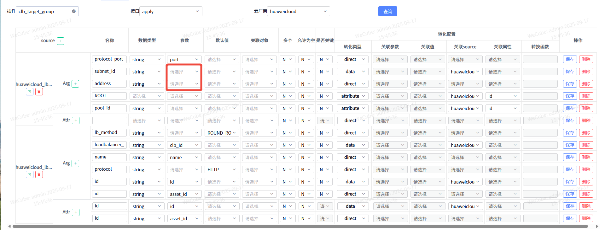

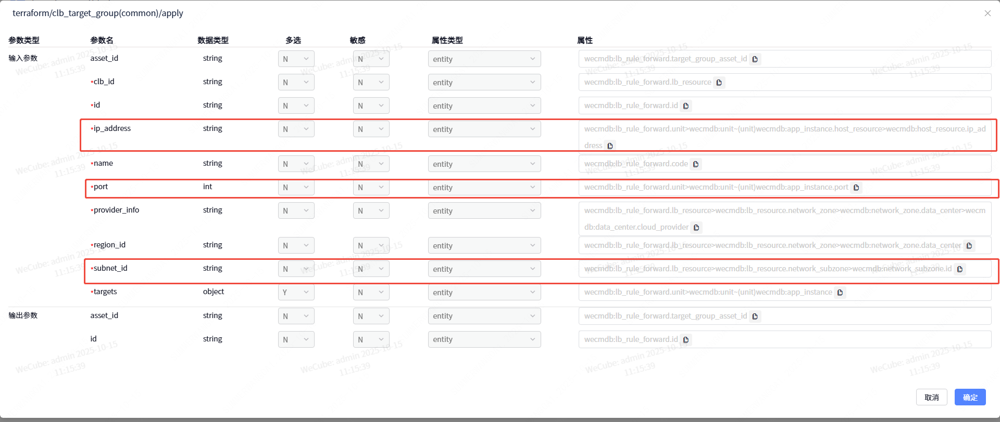

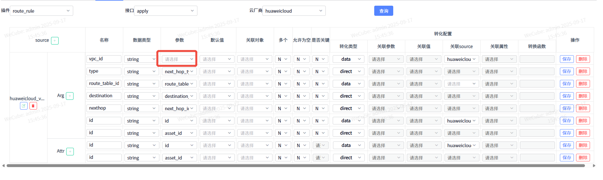

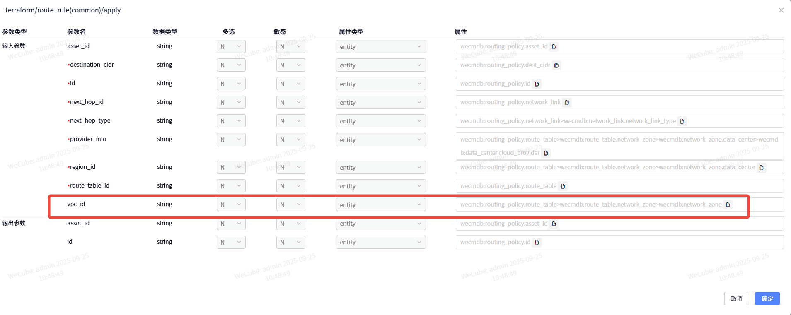

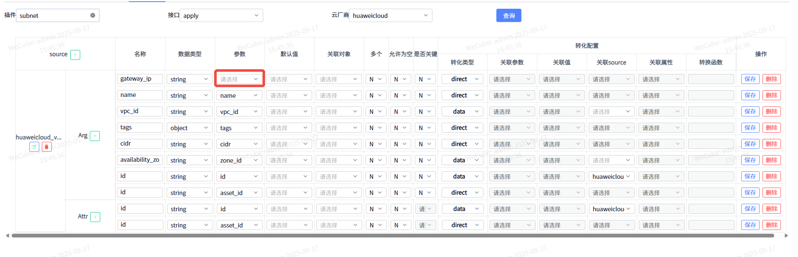

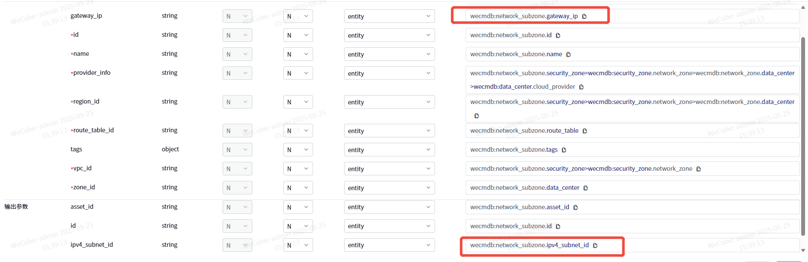

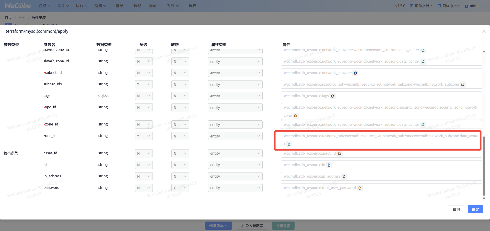

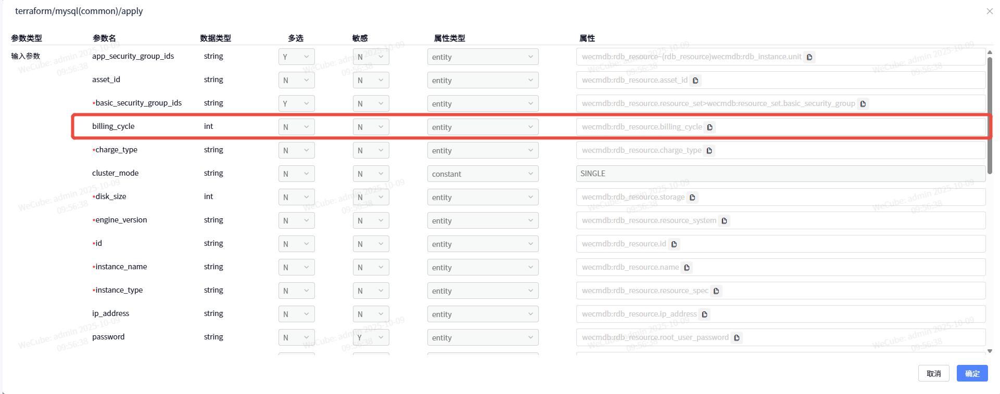

---

|  | **clb_target_group** | **入参：需添加subnet_id(对应主机子网ID)和ip_address(对应主机ipV4地址)** |  | **插件服务新增了subnet_id、ip_address、port的配置** |
| --- | --- | --- | --- | --- |
|  | route_rule | 入参：需添加vpc_id字段 |  | 插件服务添加vpc_id字段，配置对应表达式 |
|  | subnet | 入参：需添加子网的网关IP字段gateway_ip 出参：ipv4_subnet_id |  | 1. gateway_ip字段已有了，直接在cmdb给默认值了 2. (1)首先在terraform插件服务添加出参ipv4_subnet_id (2)在cmdb系统模型中添加参数ipv4_subnet_id (3)在插件注册cmdb 数据模型里面同步cmdb数据 (4) terraform出参配置表达式，引用ipv4_subnet_id字段 |
|  | mysql | 入参：需要传入多个ZA，需添加zone_ids字段 |  | 插件服务添加zone_ids字段，配置对应表达式 |
|  |  | 入参：添加billing_cycle字段，对应计费周期 |  | 插件服务添加billing_cycle字段，配置对应表达式 |
|  | redis | 入参：需要添加vpc_id字段 |  | 插件服务添加vpc_id字段，配置对应表达式 |

## 编排问题记录

### 相关图片

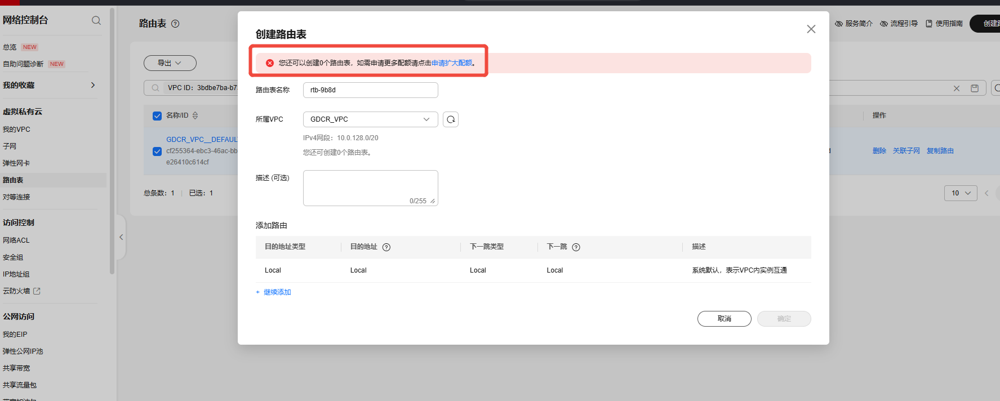

---

| **1. 创建VPC后，VPC下面会绑定一个默认路由表，导致wecube默认路由表执行报错 解决：手动从华为云把默认路由表的资产ID回填到wecube** |  |
| --- | --- |
| 2.华为云一个VPC下面只能存在一个路由表(默认路由表)，导致wecube自定义路由表创建不成功 解决：华为云官网申请扩容 |  |
| 3. 路由策略也需要手动把默认路由表的资产ID回填 |  |
| 4.创建mysql，启用zone_ids字段选定多可用区时，会报可用区不匹配的错误 创建mysql, 启动按月付费时，华为云账户余额不足，会一直创建超时不成功，启用按需付费就好了 |  |
| 5.redis创建时，会提示provider_info为空的错误 解决：插件服务provider_info表达式链路缺少安全区域，需要补充 |  |
|  |  |
| 6. 创建主机成功后，需要返回主机的IP地址，需要把access_ip_v4回传给wecube的ip_address字段 |  |
| 7. redis创建成功后，需要返回redis的连接地址，需要把domain_name回传给wecube的ip_address字段，同时模型配置里面需要取消ip_address的正则校验（因为接收的是domain_name） |  |
| 8. 主机资源、redis、mysql资源创建后，后续编排节点会遇到连接超时的错误，是因为wecube主机和购买的主机不在一个云上，网络不互通 |  |
| 9 创建LB时， |  |
|  |  |
| 10. 华为云LB创建，先创建LB均衡器，再创建LB后端组，再创建LB监听器、最后创建LB转发规则，转发规则同时绑定了监听器和后端组 LB均衡器对应CI数据为负载均衡资源、LB后端池对应CI数据为负载均衡转发规则（根据引用关系查找到对应的应用实例和主机资源）、LB监听器对应的CI数据为负载均衡实例、LB转发规则对应的CI数据也为负载均衡转发规则 |  |

## 图片资源

以下是文档中包含的所有图片:

- **资源组2**: 
- **资源组2**: 
- **后端需添加字段**: 
- **后端需添加字段**: 
- **后端需添加字段**: 
- **后端需添加字段**: 
- **后端需添加字段**: 
- **后端需添加字段**: 
- **后端需添加字段**: 
- **后端需添加字段**: 
- **编排问题记录**: 

